# Lecture Notes: SQL Server Indexes and Introduction to Distributed Systems

## Course context

These notes introduce two large topics that are deeply connected in real systems:

1. **SQL Server indexes** — how a database finds rows efficiently.
2. **Distributed systems** — how many computers cooperate when one machine is not enough.

The common idea is simple:

> A system becomes useful at scale only when it can avoid doing unnecessary work.

Indexes avoid unnecessary table scanning. Distributed systems avoid relying on one overloaded or unavailable machine.

---

# Part 1 — SQL Server Indexes

## 1. Why databases need indexes

Imagine a table with millions of rows:

```sql
SELECT *
FROM Students
WHERE StudentId = 105432;
```

Without an index, SQL Server may need to check many rows to find the matching one.

This is called a **table scan** or **heap scan**.

Conceptually:

```text
Row 1: StudentId = 10      not match
Row 2: StudentId = 11      not match
Row 3: StudentId = 12      not match
...
Row 900000: StudentId = 105432   match
```

This is slow because the database must inspect a large part of the table.

An index gives SQL Server a faster path to the needed rows.

---

## 2. What is an index?

An **index** is an additional data structure maintained by the database to make searches faster.

A useful simplified explanation is:

> An index is a sorted copy of part of the table data that helps SQL Server find rows quickly.

More precisely:

* An index stores selected column values.
* It stores them in an ordered structure.
* It stores a pointer or locator to the actual row.
* It may also store extra included columns.
* SQL Server keeps the index updated when data changes.

For example, suppose we have this table:

```sql
CREATE TABLE Students
(
    StudentId INT PRIMARY KEY,
    FullName NVARCHAR(100),
    GroupName NVARCHAR(20),
    BirthDate DATE
);
```

If we create an index on `FullName`:

```sql
CREATE INDEX IX_Students_FullName
ON Students (FullName);
```

SQL Server stores something conceptually similar to this:

```text
Index IX_Students_FullName

FullName              Row locator
---------------------------------
'Adam Smith'           -> row 17
'Anna Brown'           -> row 45
'David Green'          -> row 12
'Maria Ivanova'        -> row 88
```

The table itself may be stored differently, but the index keeps `FullName` values sorted so the database can search faster.

---

## 3. Index as a copy of data

It is important to understand that an index is not just an abstract idea. It occupies physical storage.

When you create an index, SQL Server creates additional pages on disk.

That means:

* The table stores the original data.
* The index stores a copy of selected data.
* The index also stores row locators.
* Some indexes may include additional copied columns.

Diagram:

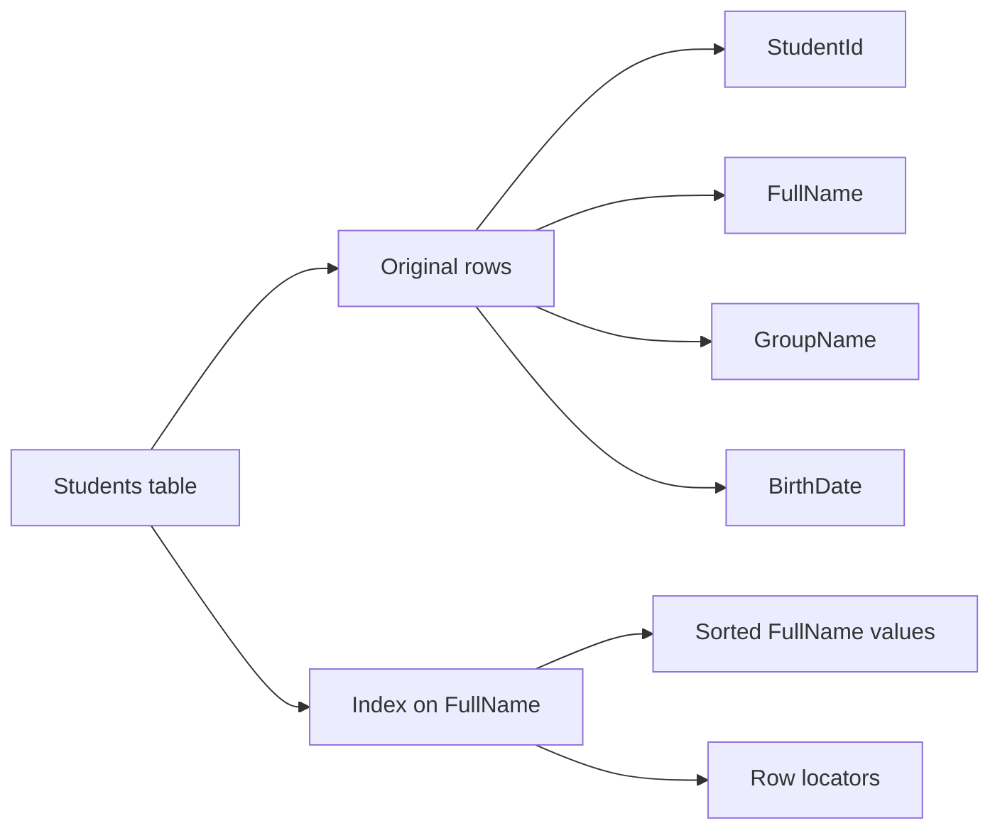

This is why indexes are not free.

They improve reads, but they cost:

* extra disk space;
* extra memory usage;
* slower inserts;
* slower updates;
* slower deletes.

Every time a row changes, SQL Server may need to update one or more indexes.

---

## 4. Table scan versus index seek

Without an index, SQL Server may scan the table.

With a useful index, SQL Server can perform an **index seek**.

A table scan means:

> Look through many rows, possibly all rows.

An index seek means:

> Navigate directly to the relevant part of the index.

Example:

```sql
SELECT *
FROM Students
WHERE FullName = N'Anna Brown';
```

If there is no index on `FullName`, SQL Server may scan the whole table.

If there is an index on `FullName`, SQL Server can seek to `'Anna Brown'`.

Diagram:

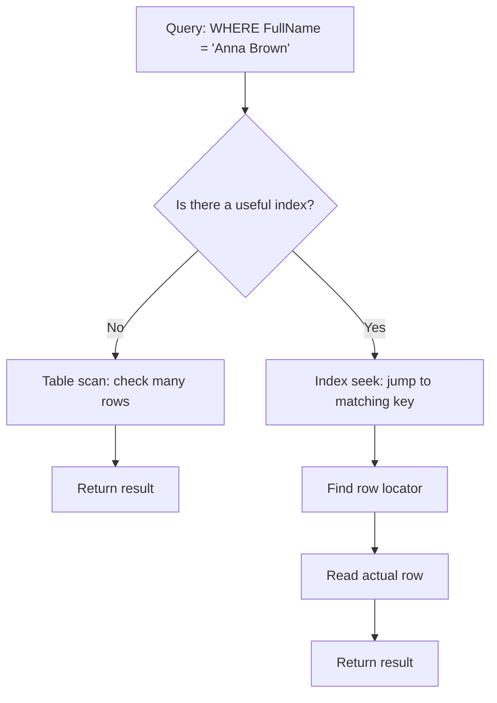

---

## 5. What is EXPLAIN?

Many database systems have a command called `EXPLAIN`.

The idea of `EXPLAIN` is:

> Show how the database plans to execute a query.

SQL Server does not usually use the word `EXPLAIN` as a command. Instead, SQL Server uses **execution plans**.

An execution plan shows:

* whether SQL Server scans a table;
* whether it uses an index;
* which joins it uses;
* estimated number of rows;
* estimated cost;
* warnings such as missing indexes.

In SQL Server, we can inspect a plan using commands such as:

```sql
SET SHOWPLAN_TEXT ON;

SELECT *
FROM Students
WHERE FullName = N'Anna Brown';

SET SHOWPLAN_TEXT OFF;
```

Or with XML plans:

```sql
SET SHOWPLAN_XML ON;

SELECT *
FROM Students
WHERE FullName = N'Anna Brown';

SET SHOWPLAN_XML OFF;
```

In SQL Server Management Studio, there are also graphical plans:

* **Estimated Execution Plan** — what SQL Server thinks it will do.
* **Actual Execution Plan** — what SQL Server actually did.

Conceptually:

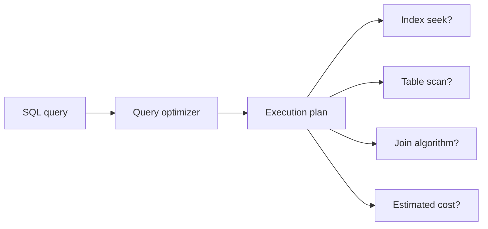

---

## 6. The query optimizer

SQL Server does not blindly execute SQL text line by line.

Instead, it uses the **query optimizer**.

The optimizer tries to choose a good execution plan.

It considers:

* available indexes;
* table sizes;
* statistics;
* join conditions;
* filters;
* estimated number of matching rows;
* cost of reading from disk or memory.

Example query:

```sql
SELECT *
FROM Orders
WHERE CustomerId = 10
  AND OrderDate >= '2026-01-01';
```

If SQL Server has an index on `CustomerId`, it may use it.

If SQL Server has an index on `OrderDate`, it may use it.

If SQL Server has a composite index on `(CustomerId, OrderDate)`, that may be even better.

---

## 7. B-tree and B+ tree indexes

SQL Server indexes are commonly explained as **B-tree indexes**.

Technically, SQL Server rowstore indexes are closer to a **B+ tree** structure.

The important idea is:

> A B-tree-like index is a balanced tree that allows SQL Server to find values quickly.

A B-tree has levels:

* root page;
* intermediate pages;
* leaf pages.

The root helps SQL Server decide where to go next.

The leaf level contains the actual sorted index entries.

Diagram:

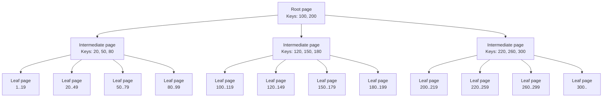

When searching for key `155`, SQL Server does not scan every row.

It does something like:

```text
Start at root.
155 is between 100 and 200, go to middle branch.
At intermediate page, 155 is between 150 and 180.
Go to leaf page containing 150..179.
Find rows with key 155.
```

This is much faster than scanning the whole table.

---

## 8. Why B-trees are efficient

A B-tree is efficient because each page contains many keys.

It is not like a binary tree where each node has only two children.

A B-tree page can point to many child pages.

That means the tree is usually shallow.

Even for millions of rows, SQL Server may need only a few page reads to reach the leaf level.

Conceptually:

```text
Large table:
10,000,000 rows

Possible B-tree depth:
Root page
Intermediate page
Leaf page
Data row
```

The database can reach the needed data in a small number of steps.

---

## 9. Clustered index

A **clustered index** defines the physical order of the table data.

In SQL Server, a table can have only one clustered index because the data rows can be physically ordered in only one main way.

Example:

```sql
CREATE CLUSTERED INDEX IX_Students_StudentId
ON Students (StudentId);
```

If `StudentId` is the clustered key, the table data is organized by `StudentId`.

Diagram:

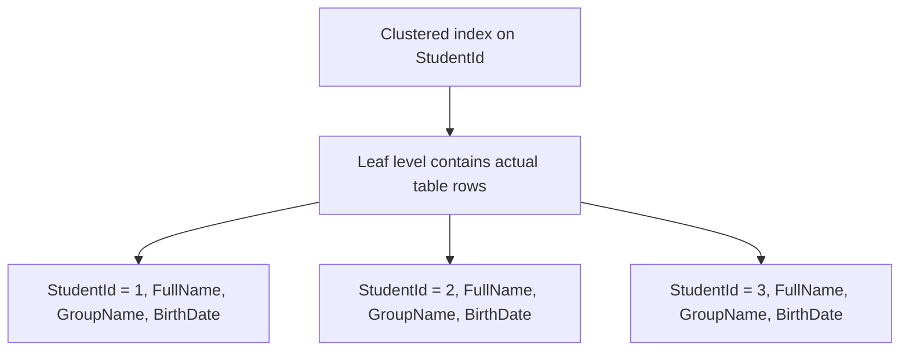

Important idea:

> In a clustered index, the leaf level is the actual table data.

---

## 10. Nonclustered index

A **nonclustered index** is separate from the table data.

It contains:

* index key columns;
* row locator;
* optionally included columns.

Example:

```sql
CREATE NONCLUSTERED INDEX IX_Students_GroupName
ON Students (GroupName);
```

Diagram:

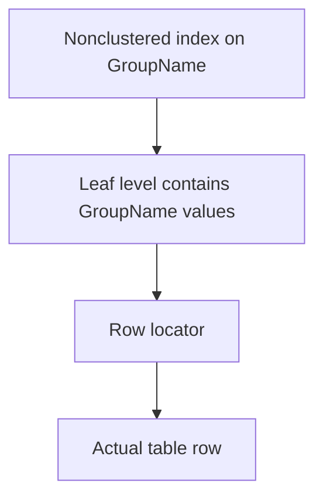

If the query needs columns not stored in the index, SQL Server may need to do an extra lookup.

Example:

```sql
SELECT FullName, BirthDate
FROM Students
WHERE GroupName = N'CS-201';
```

If the index only contains `GroupName`, SQL Server uses the index to find matching rows, then reads the actual table rows to get `FullName` and `BirthDate`.

This extra step is called a **lookup**.

---

## 11. Covering index

A **covering index** is an index that contains all columns needed by a query.

Example query:

```sql
SELECT FullName, BirthDate
FROM Students
WHERE GroupName = N'CS-201';
```

A useful covering index could be:

```sql
CREATE INDEX IX_Students_GroupName_Covering
ON Students (GroupName)
INCLUDE (FullName, BirthDate);
```

Now the index contains:

* `GroupName` as the search key;
* `FullName` and `BirthDate` as included columns.

SQL Server can answer the query using only the index.

Diagram:

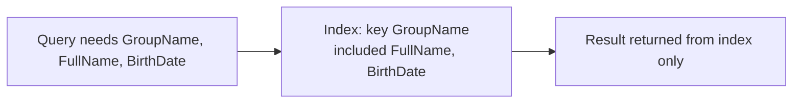

A covering index can be very fast.

But it also uses more storage.

---

## 12. Composite index

A **composite index** uses more than one key column.

Example:

```sql
CREATE INDEX IX_Orders_CustomerId_OrderDate
ON Orders (CustomerId, OrderDate);
```

This index is sorted first by `CustomerId`, then by `OrderDate`.

It is useful for queries like:

```sql
SELECT *
FROM Orders
WHERE CustomerId = 10
  AND OrderDate >= '2026-01-01';
```

But column order matters.

The index `(CustomerId, OrderDate)` is usually useful for:

```sql
WHERE CustomerId = 10
```

and:

```sql
WHERE CustomerId = 10
  AND OrderDate >= '2026-01-01'
```

It may be less useful for:

```sql
WHERE OrderDate >= '2026-01-01'
```

because `OrderDate` is not the first key.

Diagram:

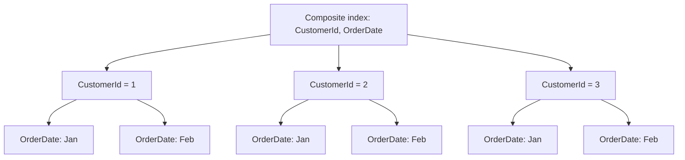

The data is not globally sorted by `OrderDate`.

It is sorted by `OrderDate` only inside each `CustomerId`.

---

## 13. Selectivity

**Selectivity** means how well a column filters rows.

A highly selective column has many different values and returns a small part of the table.

Examples of high-selectivity columns:

* `StudentId`
* `Email`
* `OrderId`
* `PassportNumber`

A low-selectivity column has few distinct values and returns a large part of the table.

Examples of low-selectivity columns:

* `Gender`
* `IsActive`
* `Status`
* `Country` in a table where almost everyone is from the same country

Diagram:

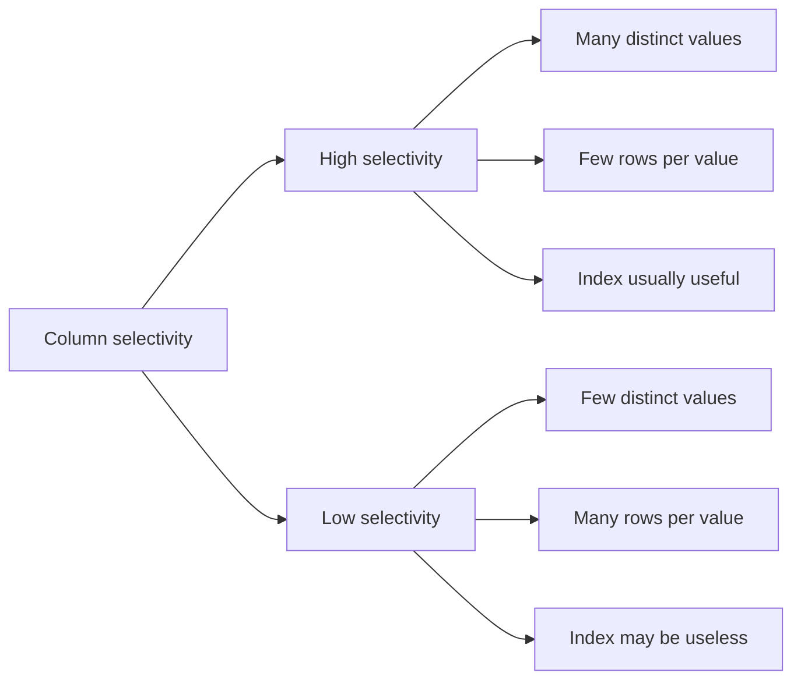

---

## 14. Low-selectivity problem

Indexes are not always useful.

Suppose a table has 1,000,000 users.

Column `IsActive` contains:

```text
IsActive = 1 for 990,000 rows
IsActive = 0 for 10,000 rows
```

This query returns almost the whole table:

```sql
SELECT *
FROM Users
WHERE IsActive = 1;
```

Even if there is an index on `IsActive`, SQL Server may decide not to use it.

Why?

Because using the index would still produce 990,000 matching rows.

Then SQL Server would need to read almost all rows anyway.

In such cases, scanning the table may be cheaper.

Diagram:

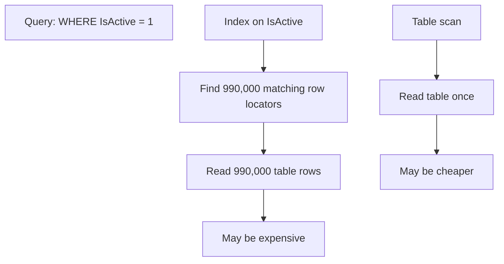

Low selectivity does not mean an index is always bad.

For example:

```sql
SELECT *
FROM Users
WHERE IsActive = 0;
```

If only 10,000 out of 1,000,000 users are inactive, the index may be useful.

The same column can be useful for one value and useless for another.

---

## 15. Indexes and writes

Indexes make reads faster, but writes slower.

When inserting a row, SQL Server must:

1. Insert the row into the table.
2. Insert entries into every relevant index.
3. Possibly split index pages.
4. Update statistics later if necessary.

Diagram:

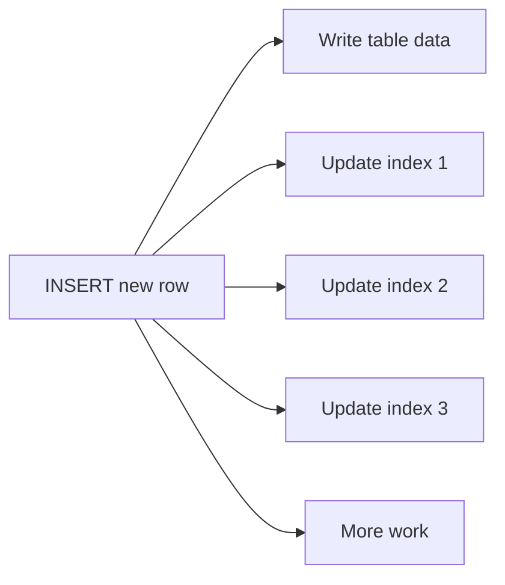

Therefore, a table should not have unlimited indexes.

Indexes should be created for important queries, not for every column.

---

## 16. Basic index usage strategy

A good index strategy asks:

1. What queries are frequent?
2. What queries are slow?
3. Which columns are used in `WHERE`?
4. Which columns are used in `JOIN`?
5. Which columns are used in `ORDER BY`?
6. Which columns are selective?
7. Which columns are returned by the query?
8. How often does the table change?

Example:

```sql
SELECT OrderId, OrderDate, TotalAmount
FROM Orders
WHERE CustomerId = 100
ORDER BY OrderDate DESC;
```

A useful index may be:

```sql
CREATE INDEX IX_Orders_CustomerId_OrderDate
ON Orders (CustomerId, OrderDate DESC)
INCLUDE (TotalAmount);
```

This index helps because:

* `CustomerId` filters rows;
* `OrderDate` supports sorting;
* `TotalAmount` is included for output.

---

## 17. Summary of indexes

An index is a tradeoff.

It gives faster reads, but costs storage and write performance.

Main ideas:

* An index is a sorted copy of selected data.
* SQL Server uses indexes through execution plans.
* `EXPLAIN` means inspecting the execution plan.
* SQL Server commonly uses B-tree-like structures.
* Clustered indexes store actual table rows at the leaf level.
* Nonclustered indexes store keys and row locators.
* Covering indexes can answer queries without reading the table.
* Low-selectivity columns may not benefit from indexes.
* Good indexes should match real query patterns.

---

# Part 2 — Introduction to Distributed Systems

## 18. What is a distributed system?

A **distributed system** is a system where multiple computers work together and appear to the user as one system.

The computers communicate over a network.

Example:

```text
A website is opened by a user.
The page may involve:

- web server;
- database server;
- cache server;
- file storage server;
- authentication service;
- payment service.
```

To the user, this looks like one application.

Internally, it is a group of machines.

Diagram:

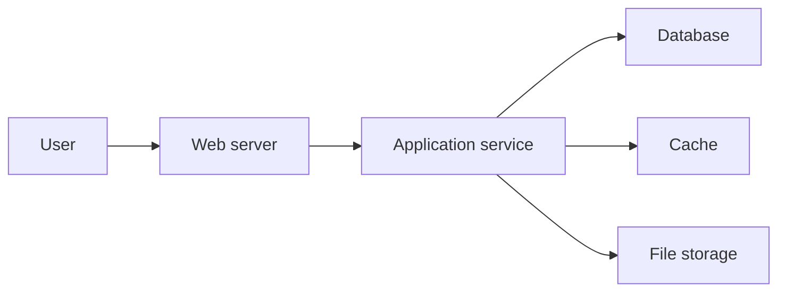

---

## 19. What is a node?

A **node** is one participating machine or process in a distributed system.

A node can be:

* a physical server;
* a virtual machine;
* a container;
* a database instance;
* a cache instance;
* a worker process.

The important idea is:

> A node is one independent participant that can compute, store data, send messages, receive messages, and fail.

Diagram:

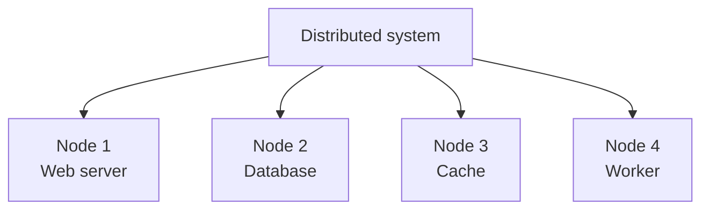

A distributed system is difficult because nodes do not share memory.

They communicate by sending messages through the network.

---

## 20. What is ping?

`ping` is a simple network tool used to test whether another machine can be reached.

Example:

```bash
ping example.com
```

A simplified output may look like:

```text
64 bytes from example.com: time=24 ms
64 bytes from example.com: time=25 ms
64 bytes from example.com: time=23 ms
```

The important number is latency.

Latency means:

> How long it takes for a message to go to another machine and come back.

A ping time of `24 ms` means a round trip took about 24 milliseconds.

Diagram:

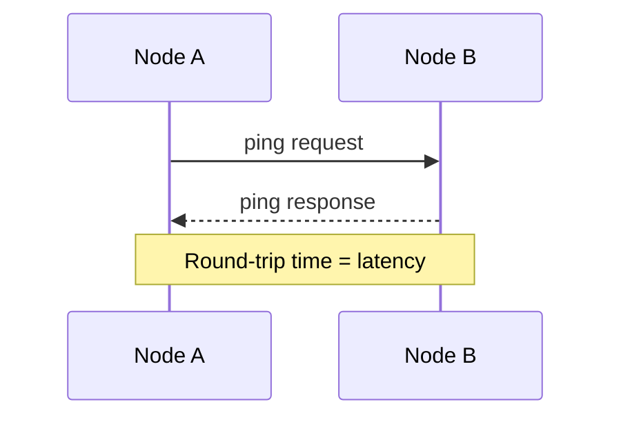

---

## 21. Limitations of data transfer

In a single computer, memory access is very fast.

In a distributed system, communication happens through a network, which is much slower and less reliable.

Data transfer has several limitations.

### 21.1 Latency

Latency is delay.

Even if the message is small, it takes time to travel.

```text
Small message + long distance = still delayed
```

Distance matters because signals cannot travel faster than the speed of light.

A message from one continent to another cannot be instant.

### 21.2 Bandwidth

Bandwidth is how much data can be transferred per second.

Example:

```text
Low latency:
The first byte arrives quickly.

High bandwidth:
A large file can be transferred quickly.
```

Latency and bandwidth are different.

A truck full of hard drives has high bandwidth but very high latency.

### 21.3 Packet loss

Networks can lose packets.

If packets are lost, they may need to be retransmitted.

This creates delays.

### 21.4 Congestion

If many systems use the same network path, traffic becomes congested.

The system slows down.

### 21.5 Serialization cost

Before sending data, a program often converts objects into bytes.

This is called serialization.

After receiving data, the receiver converts bytes back into objects.

This is deserialization.

Both cost CPU time.

Diagram:

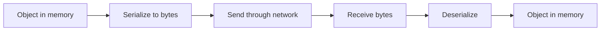

### 21.6 Network failure

A message may not arrive.

The sender may not know why.

Possible reasons:

* receiver crashed;
* network cable failed;
* router failed;
* firewall blocked traffic;
* receiver is slow;
* message was lost.

The sender only sees a timeout.

This uncertainty is one of the main problems in distributed systems.

---

## 22. What is big data?

For this lecture, we use the following definition:

> Big data is a system of data processing where the amount of data could not fit into a single node.

This definition is practical.

It means that one machine is not enough because of at least one limitation:

* not enough disk;
* not enough memory;
* not enough CPU;
* not enough network throughput;
* not enough fault tolerance;
* not enough time to process data.

Diagram:

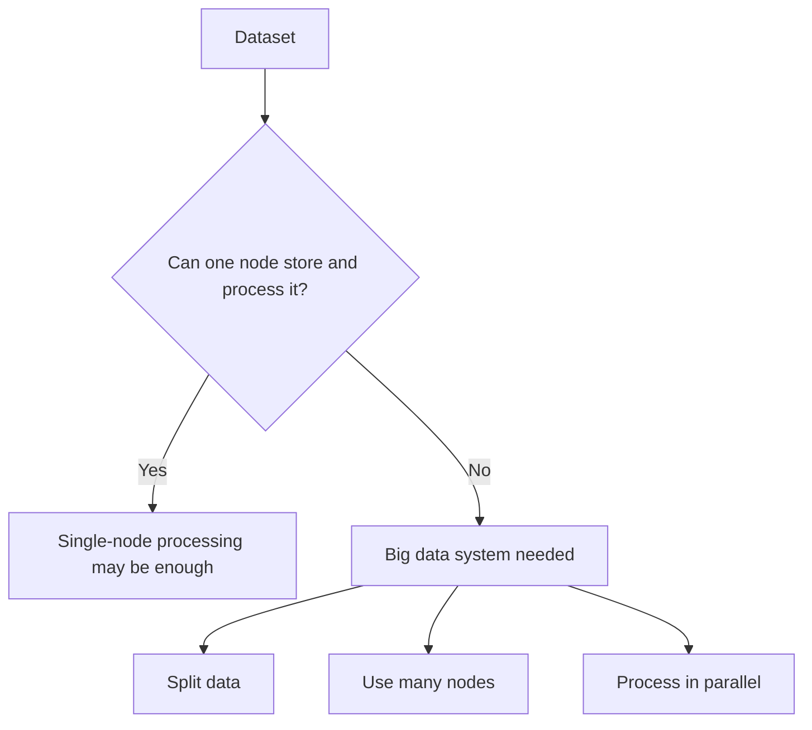

Example:

```text
One server has:
- 1 TB disk
- 64 GB RAM

Dataset:
- 500 TB logs

Result:
The data cannot fit into one node.
A distributed data processing system is needed.
```

---

## 23. Motivation for distributed systems

Distributed systems exist because one node is limited.

The main motivations are:

1. Capacity constraints.
2. Availability.
3. Geo-distribution.
4. Redundancy.
5. Parallel processing.
6. Organizational separation.

---

## 24. Capacity constraints

One machine has limited resources.

It has limited:

* CPU cores;
* RAM;
* disk space;
* disk speed;
* network bandwidth.

When the workload becomes too large, we can add more machines.

This is called horizontal scaling.

Diagram:

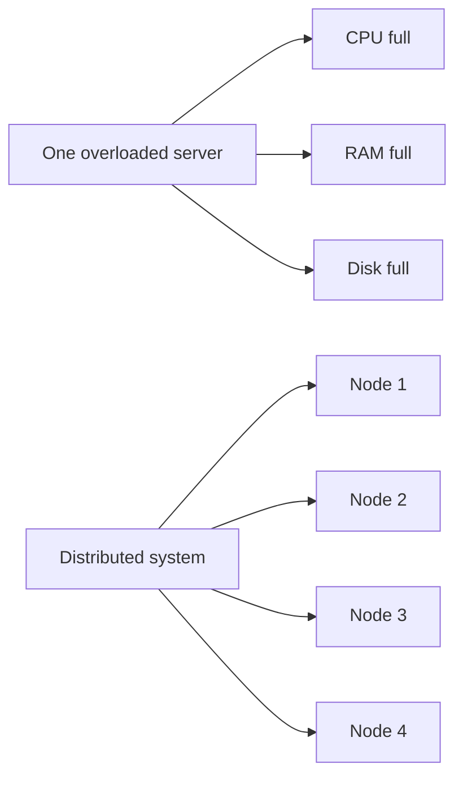

Vertical scaling means making one machine stronger.

Horizontal scaling means adding more machines.

```text
Vertical scaling:
One bigger server.

Horizontal scaling:
Many servers.
```

Horizontal scaling is often necessary because one server cannot grow forever.

---

## 25. Availability

Availability means:

> The system continues to work when some parts fail.

If there is only one server and it fails, the whole system is down.

Diagram:

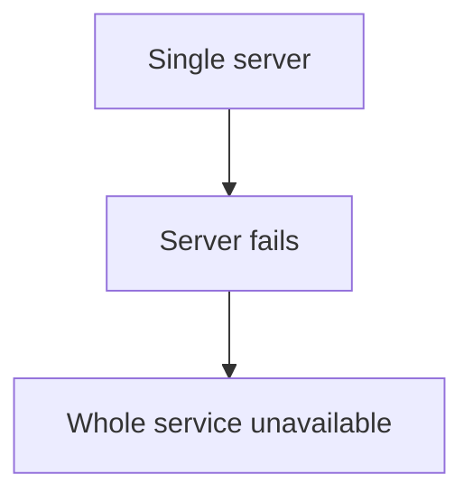

With multiple nodes, the system may continue working.

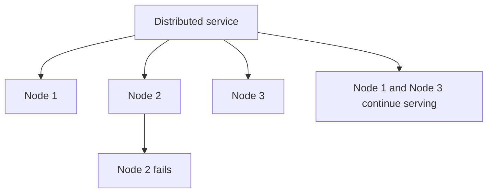

Availability is one of the main reasons for replication.

---

## 26. Geo-distribution

Geo-distribution means placing nodes in different geographic locations.

Example:

* one node in Europe;
* one node in the USA;
* one node in Asia.

This helps because:

* users are closer to servers;
* latency is lower;
* service can survive regional failures;
* local laws may require local data storage.

Diagram:

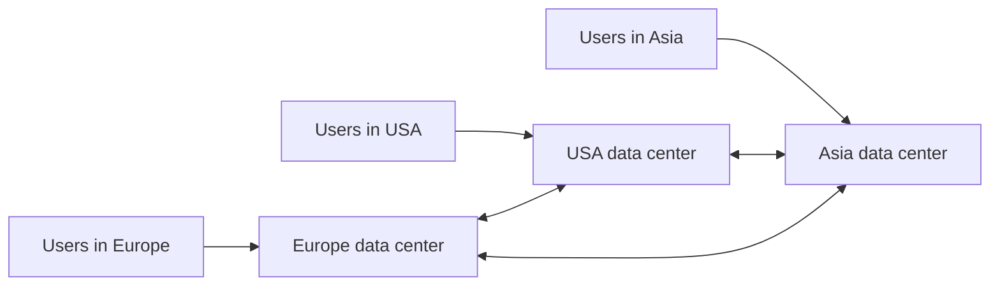

But geo-distribution makes consistency harder.

If a user changes data in Europe, when should users in Asia see the change?

Immediately?

After one second?

After one minute?

This question leads to CAP theorem and replication consistency.

---

## 27. Redundancy

Redundancy means storing or running extra copies so that failure does not destroy the system.

Example:

```text
Without redundancy:
One disk fails -> data lost.

With redundancy:
Data is stored on several disks or nodes.
One disk fails -> data still exists.
```

Diagram:

```mermaid
flowchart TD
    D["Important data"]

    D --> N1["Copy on Node 1"]
    D --> N2["Copy on Node 2"]
    D --> N3["Copy on Node 3"]

    N2 --> F["Node 2 fails"]
    N1 --> OK["Data still available"]
    N3 --> OK
```

Redundancy is essential for reliability.

But redundancy creates a difficult question:

> If data exists in several places, how do we keep all copies correct?

---

# Part 3 — CAP Theorem

## 28. The basic problem of distributed data

Suppose data is stored on several nodes.

A user writes new data to Node A.

Another user reads from Node B.

Question:

> Should Node B immediately return the new data?

If yes, the system needs strong coordination.

If no, the system may be faster and more available, but users may see old data.

This is the central tradeoff.

---

## 29. CAP theorem

CAP theorem says that in a distributed data system, when a network partition happens, the system must choose between:

* **Consistency**
* **Availability**
* **Partition tolerance**

The three letters mean:

### Consistency

Every read receives the latest write or an error.

In simple words:

> All users see the same correct data.

### Availability

Every request receives a response, even if some nodes cannot communicate.

In simple words:

> The system continues answering.

### Partition tolerance

The system continues operating despite network communication failure between nodes.

In simple words:

> The network can break, and the system must still deal with it.

Diagram:

```mermaid
flowchart TD
    CAP["CAP theorem"]

    CAP --> C["Consistency<br/>same latest data"]
    CAP --> A["Availability<br/>always responds"]
    CAP --> P["Partition tolerance<br/>network can split"]
```

The important part is not that a system can choose any two forever.

The important part is:

> During a network partition, a distributed system must choose between consistency and availability.

Because partitions can happen in real networks, distributed systems must tolerate partitions.

So the real choice is usually:

```text
When the network is broken:
Should we reject some requests to preserve consistency?
Or should we answer requests and risk stale/conflicting data?
```

---

## 30. CAP example: three people registering strangers

Imagine three people working in three remote locations.

Their job is to register strangers.

Each person has:

* their own notebook list;
* a phone to call the other two people.

The rule is:

> The same stranger must not be registered twice.

People:

```text
Alice: Location A
Bob: Location B
Carol: Location C
```

Each has a local list.

Diagram:

```mermaid
flowchart LR
    A["Alice<br/>Location A<br/>Local list"]
    B["Bob<br/>Location B<br/>Local list"]
    C["Carol<br/>Location C<br/>Local list"]

    A <-->|phone| B
    B <-->|phone| C
    C <-->|phone| A
```

Now a stranger named John arrives at Alice's location.

Alice checks her local list.

John is not there.

But maybe John was already registered by Bob or Carol.

So Alice calls Bob and Carol.

If the phones work, Alice can ask:

```text
Alice: Do you already have John?
Bob: No.
Carol: No.
Alice: Then I will register John.
```

Now everyone updates their lists.

This gives consistency.

---

## 31. Partition in the registration example

Now suppose the phone network fails.

Alice cannot call Bob or Carol.

John arrives at Alice's location.

Alice has two choices.

### Choice 1: preserve consistency

Alice refuses to register John until the phones work.

```text
Alice: I cannot contact Bob and Carol.
Alice: I will not register John.
```

Result:

* No duplicate registration.
* Consistency is preserved.
* Availability is lost because Alice cannot serve John.

This is CP behavior.

Diagram:

```mermaid
flowchart TD
    A["John arrives at Alice"]
    B["Phone network broken"]
    C["Alice cannot check Bob and Carol"]
    D["Alice refuses registration"]
    E["Consistency preserved"]
    F["Availability reduced"]

    A --> B --> C --> D
    D --> E
    D --> F
```

### Choice 2: preserve availability

Alice registers John using only her local list.

```text
Alice: I cannot contact Bob and Carol.
Alice: But I will register John anyway.
```

At the same time, John may also appear at Bob's location.

Bob also registers John.

Result:

* Both locations accepted requests.
* Availability is preserved.
* Consistency may be broken.

This is AP behavior.

Diagram:

```mermaid
flowchart TD
    A["Phone network broken"]

    A --> B["John arrives at Alice"]
    A --> C["John arrives at Bob"]

    B --> D["Alice registers John"]
    C --> E["Bob registers John"]

    D --> F["Duplicate registration possible"]
    E --> F

    F --> G["Availability preserved"]
    F --> H["Consistency broken"]
```

This example shows the core CAP problem.

When communication fails, the system cannot always guarantee both:

* everyone answers;
* everyone has the same correct data.

---

## 32. CAP and RDBMS

Traditional relational databases, such as SQL Server or PostgreSQL, usually prioritize consistency on a single main database.

On one node, CAP is not the main issue because there is no distributed network partition inside the database cluster.

But when relational databases are distributed through replication, CAP tradeoffs appear.

A typical strongly consistent RDBMS setup may choose consistency over availability.

Example:

```text
Main database must confirm writes.
If replicas cannot confirm, the system may block or fail the write.
```

This is closer to CP behavior.

Diagram:

```mermaid
flowchart TD
    U["User writes transaction"]
    M["Main RDBMS node"]
    R1["Replica 1"]
    R2["Replica 2"]

    U --> M
    M --> R1
    M --> R2

    R1 --> ACK1["ACK"]
    R2 --> ACK2["ACK"]

    ACK1 --> COMMIT["Commit transaction"]
    ACK2 --> COMMIT
```

If a replica is unreachable and synchronous confirmation is required, the main node may reject or delay the write.

This protects consistency but reduces availability.

---

## 33. CAP and Cassandra

Apache Cassandra is a distributed NoSQL database designed for high availability and horizontal scaling.

Cassandra commonly allows writes to continue even when some nodes are unavailable.

It uses replication and tunable consistency.

Example:

```text
Write can be accepted by some replicas.
Other replicas may receive the update later.
```

This is often described as AP-style behavior.

Diagram:

```mermaid
flowchart TD
    U["Client write"]
    C["Cassandra coordinator node"]

    C --> N1["Replica 1<br/>available"]
    C --> N2["Replica 2<br/>available"]
    C -.-> N3["Replica 3<br/>unavailable"]

    N1 --> OK["Write accepted"]
    N2 --> OK

    OK --> L["Replica 3 repaired later"]
```

Cassandra may allow temporary inconsistency.

Later, the system repairs differences using mechanisms such as read repair, hinted handoff, and anti-entropy repair.

The tradeoff:

```text
Better availability and scalability.
Potentially weaker immediate consistency.
```

---

## 34. CAP and Redis

Redis is often used as an in-memory cache, message broker, or fast key-value store.

A simple Redis primary-replica setup usually has one primary node that accepts writes and one or more replicas that copy data.

Diagram:

```mermaid
flowchart LR
    C["Client"] --> P["Redis primary"]
    P --> R1["Redis replica 1"]
    P --> R2["Redis replica 2"]
```

If the primary fails, Redis Sentinel or Redis Cluster may promote a replica.

However, replication can be asynchronous.

That means some recent writes may be lost if the primary fails before replicas receive them.

Diagram:

```mermaid
sequenceDiagram
    participant Client
    participant Primary
    participant Replica

    Client->>Primary: SET x = 10
    Primary-->>Client: OK
    Note over Primary,Replica: Primary fails before replication
    Replica-->>Client: x may be missing after failover
```

Redis often favors speed and availability, depending on configuration.

But strong consistency is not automatic in simple asynchronous replication.

---

## 35. CAP and blockchain

Blockchain systems are also distributed systems.

Many nodes maintain copies of a ledger.

They use consensus rules to agree on the valid chain or valid blocks.

Blockchain systems are special because they usually prioritize:

* consistency of the final ledger;
* partition tolerance;
* resistance to malicious nodes.

But they often have limited availability for fast final writes.

Why?

Because a transaction may not be final immediately.

The network needs time to agree.

Diagram:

```mermaid
flowchart TD
    T["User sends transaction"]
    N1["Node 1 receives transaction"]
    N2["Node 2 receives transaction"]
    N3["Node 3 receives transaction"]

    T --> N1
    T --> N2
    T --> N3

    N1 --> B["Candidate block"]
    N2 --> B
    N3 --> B

    B --> C["Consensus process"]
    C --> F["Transaction becomes final later"]
```

During a partition, different groups of nodes may temporarily see different versions of the chain.

After the partition heals, one version may win according to protocol rules.

This means:

* immediate finality may be limited;
* transactions may need confirmations;
* the system may be slow compared to a centralized database.

So blockchain is not simply “always available”.

It is distributed and partition-tolerant, but useful availability is limited by consensus and finality requirements.

---

## 36. CAP comparison table

| System type                   |                           Typical priority | Tradeoff                                                          |
| ----------------------------- | -----------------------------------------: | ----------------------------------------------------------------- |
| Single-node RDBMS             |                                Consistency | Not really distributed, single point of failure unless replicated |
| Synchronous RDBMS replication |          Consistency + partition tolerance | May reject/block writes during failures                           |
| Cassandra-style systems       |         Availability + partition tolerance | May allow temporary inconsistency                                 |
| Redis async replication       |                       Speed + availability | Recent writes may be lost during failover                         |
| Blockchain                    | Consistency/finality + partition tolerance | Slow finality and limited immediate availability                  |

Important note:

> Real systems are configurable. The table shows common behavior, not an absolute rule for every installation.

---

# Part 4 — Replication, Sharding, and Partitioning

## 37. Replication

Replication means storing copies of the same data on multiple nodes.

Example:

```text
Data X is stored on Node A, Node B, and Node C.
```

Diagram:

```mermaid
flowchart TD
    D["Data item: User 42"]

    D --> A["Node A copy"]
    D --> B["Node B copy"]
    D --> C["Node C copy"]
```

Why replicate?

* higher availability;
* fault tolerance;
* faster reads;
* geographic distribution;
* backup and disaster recovery.

If one node fails, another node still has the data.

---

## 38. Main-follower replication

In many RDBMS systems, replication uses a main-follower model.

This is also called:

* primary-replica;
* leader-follower;
* master-slave in older terminology.

In these notes, we use **main-follower**.

The main node accepts writes.

Follower nodes copy data from the main node.

Diagram:

```mermaid
flowchart LR
    C1["Write client"] --> M["Main database"]

    M --> F1["Follower 1"]
    M --> F2["Follower 2"]
    M --> F3["Follower 3"]

    R1["Read client"] --> F1
    R2["Read client"] --> F2
```

Typical rules:

* writes go to the main node;
* followers receive replicated changes;
* reads may go to followers;
* if the main fails, a follower may be promoted.

---

## 39. Synchronous replication

In synchronous replication, the main waits for followers before confirming a write.

Example:

```text
Client writes data.
Main sends data to follower.
Follower confirms.
Main confirms to client.
```

Diagram:

```mermaid
sequenceDiagram
    participant Client
    participant Main
    participant Follower

    Client->>Main: Write x = 10
    Main->>Follower: Replicate x = 10
    Follower-->>Main: ACK
    Main-->>Client: Commit OK
```

Advantage:

* stronger consistency;
* less data loss during failure.

Disadvantage:

* slower writes;
* lower availability if follower is unreachable.

---

## 40. Asynchronous replication

In asynchronous replication, the main confirms the write before followers receive it.

Diagram:

```mermaid
sequenceDiagram
    participant Client
    participant Main
    participant Follower

    Client->>Main: Write x = 10
    Main-->>Client: Commit OK
    Main->>Follower: Replicate x = 10 later
```

Advantage:

* faster writes;
* better availability.

Disadvantage:

* follower can be stale;
* recent data may be lost if main fails before replication.

---

## 41. Read-only followers in RDBMS

In many relational database systems, follower replicas are read-only.

This means:

* applications can read from followers;
* applications cannot write to followers;
* all writes go to the main database.

This improves read scalability.

Example:

```sql
-- Write query goes to main
INSERT INTO Orders(CustomerId, TotalAmount)
VALUES (10, 250.00);

-- Read query may go to follower
SELECT *
FROM Orders
WHERE CustomerId = 10;
```

Diagram:

```mermaid
flowchart TD
    A["Application"]

    A -->|INSERT, UPDATE, DELETE| M["Main RDBMS node"]
    A -->|SELECT| F1["Read-only follower 1"]
    A -->|SELECT| F2["Read-only follower 2"]

    M -->|replication| F1
    M -->|replication| F2
```

This design is common because many applications have more reads than writes.

For example:

```text
Social network:
- Many users read posts.
- Fewer users create posts.

Online store:
- Many users browse products.
- Fewer users place orders.
```

Read-only replicas reduce load on the main database.

---

## 42. Replication lag

Replication lag is the delay between a write on the main node and the same data appearing on a follower.

Example:

```text
12:00:00 — User changes password on main.
12:00:01 — User reads from follower.
12:00:02 — Follower receives password change.
```

At `12:00:01`, the follower may still have old data.

Diagram:

```mermaid
sequenceDiagram
    participant User
    participant Main
    participant Follower

    User->>Main: Update profile name
    Main-->>User: OK

    User->>Follower: Read profile
    Follower-->>User: Old profile name

    Main->>Follower: Replication catches up
```

This is why read replicas must be used carefully.

For critical reads immediately after writes, the application may need to read from the main node.

---

## 43. Sharding

Sharding means splitting data across different nodes.

Each node stores only part of the data.

Example:

```text
Users with ID 1-1000000       -> Shard 1
Users with ID 1000001-2000000 -> Shard 2
Users with ID 2000001-3000000 -> Shard 3
```

Diagram:

```mermaid
flowchart TD
    U["Users table"]

    U --> S1["Shard 1<br/>UserId 1 - 1,000,000"]
    U --> S2["Shard 2<br/>UserId 1,000,001 - 2,000,000"]
    U --> S3["Shard 3<br/>UserId 2,000,001 - 3,000,000"]
```

Replication copies the same data.

Sharding splits different data.

Comparison:

```mermaid
flowchart LR
    A["Replication"] --> B["Same data copied to many nodes"]
    C["Sharding"] --> D["Different data placed on different nodes"]
```

---

## 44. Why sharding is useful

Sharding helps when one node cannot store or process all data.

Benefits:

* more storage capacity;
* more write throughput;
* more read throughput;
* smaller indexes per node;
* parallel processing.

Example:

```text
One database server can handle 10,000 writes per second.
The system needs 50,000 writes per second.

Possible solution:
Split users across 5 shards.
Each shard handles part of the writes.
```

Diagram:

```mermaid
flowchart LR
    A["Application"] --> Router["Shard router"]

    Router --> S1["Shard 1"]
    Router --> S2["Shard 2"]
    Router --> S3["Shard 3"]
    Router --> S4["Shard 4"]
```

The shard router decides which shard should receive the request.

---

## 45. Sharding key

A sharding key is the value used to decide where data goes.

Examples:

* `UserId`
* `CustomerId`
* `TenantId`
* `Region`
* hash of an ID

Example:

```text
shard = UserId % number_of_shards
```

Code-style example:

```text
UserId = 105
Number of shards = 4

105 % 4 = 1

User 105 goes to Shard 1.
```

Diagram:

```mermaid
flowchart TD
    A["New row: UserId = 105"]
    B["Calculate UserId % 4"]
    C["Result = 1"]
    D["Store row on Shard 1"]

    A --> B --> C --> D
```

Choosing a good sharding key is very important.

A bad sharding key creates imbalance.

---

## 46. Hot shards

A hot shard is a shard that receives too much traffic.

Example:

```text
Shard by country.

90% of users are from one country.

Result:
One shard receives 90% of traffic.
Other shards are almost idle.
```

Diagram:

```mermaid
flowchart TD
    A["Traffic"]

    A --> S1["Shard USA<br/>90% traffic"]
    A --> S2["Shard Germany<br/>3% traffic"]
    A --> S3["Shard Georgia<br/>2% traffic"]
    A --> S4["Shard Other<br/>5% traffic"]
```

This is bad because the system is distributed physically, but not distributed evenly.

Good sharding should spread data and traffic.

---

## 47. Partitioning

Partitioning means dividing data into parts.

The word is used in two related ways.

### 47.1 Logical table partitioning

Inside one database system, a large table may be partitioned into smaller parts.

Example:

```text
Orders_2024
Orders_2025
Orders_2026
```

Or a SQL Server table partitioned by date.

Diagram:

```mermaid
flowchart TD
    O["Orders table"]

    O --> P1["Partition: 2024"]
    O --> P2["Partition: 2025"]
    O --> P3["Partition: 2026"]
```

This helps with:

* faster queries on specific ranges;
* easier maintenance;
* faster deletion of old data;
* smaller indexes per partition.

### 47.2 Distributed partitioning

In distributed systems, partitioning often means splitting data across nodes.

This is similar to sharding.

Diagram:

```mermaid
flowchart TD
    D["Large dataset"]

    D --> N1["Node 1 partition"]
    D --> N2["Node 2 partition"]
    D --> N3["Node 3 partition"]
```

In practice, people sometimes use “sharding” and “partitioning” as similar words.

A useful distinction:

```text
Partitioning:
General idea of dividing data into parts.

Sharding:
Distributed partitioning where parts are stored on different nodes.
```

---

## 48. Replication plus sharding

Large systems often use both replication and sharding.

Example:

```text
Shard 1 has replicas.
Shard 2 has replicas.
Shard 3 has replicas.
```

Diagram:

```mermaid
flowchart TD
    A["Application"] --> Router["Router"]

    Router --> S1M["Shard 1 Main"]
    Router --> S2M["Shard 2 Main"]
    Router --> S3M["Shard 3 Main"]

    S1M --> S1F1["Shard 1 Follower"]
    S1M --> S1F2["Shard 1 Follower"]

    S2M --> S2F1["Shard 2 Follower"]
    S2M --> S2F2["Shard 2 Follower"]

    S3M --> S3F1["Shard 3 Follower"]
    S3M --> S3F2["Shard 3 Follower"]
```

This gives:

* capacity from sharding;
* availability from replication;
* read scalability from followers.

But it also increases complexity.

The system must know:

* which shard owns the data;
* which node is the main;
* which followers are healthy;
* how to fail over;
* how to rebalance data.

---

# Part 5 — Consensus

## 49. Why consensus is needed

Consensus means several nodes agree on one decision.

Distributed systems need consensus for decisions such as:

* Which node is the main?
* Was this transaction committed?
* Which log entry is next?
* Which version of data is correct?
* Which node owns this shard?
* Has a lock been acquired?

The problem is difficult because:

* messages can be delayed;
* messages can be lost;
* nodes can crash;
* networks can partition;
* clocks are not perfectly synchronized.

---

## 50. Simple consensus example

Suppose three nodes must agree on who is the main database node.

Nodes:

```text
Node A
Node B
Node C
```

They need one answer:

```text
Main = Node B
```

Diagram:

```mermaid
flowchart TD
    A["Node A"]
    B["Node B"]
    C["Node C"]

    A --> D["Decision: Node B is main"]
    B --> D
    C --> D
```

If nodes disagree, the system is dangerous.

Example:

```text
Node A thinks Node A is main.
Node B thinks Node B is main.
```

Then two nodes may accept writes at the same time.

This can corrupt data.

---

## 51. Split-brain problem

Split-brain happens when a distributed system accidentally has two active main nodes.

Example:

```mermaid
flowchart TD
    P["Network partition"]

    P --> G1["Group 1<br/>Node A"]
    P --> G2["Group 2<br/>Node B and Node C"]

    G1 --> M1["Node A thinks it is main"]
    G2 --> M2["Node B thinks it is main"]

    M1 --> W1["Accepts writes"]
    M2 --> W2["Accepts writes"]

    W1 --> C["Conflicting data"]
    W2 --> C
```

Consensus algorithms help prevent split-brain.

They make sure that only one leader/main is chosen.

---

## 52. Majority quorum

Many consensus systems use a majority rule.

In a cluster of three nodes, a majority is two.

In a cluster of five nodes, a majority is three.

Formula:

```text
majority = floor(N / 2) + 1
```

Examples:

```text
N = 3
majority = 2

N = 5
majority = 3

N = 7
majority = 4
```

Why majority?

Because two different majorities must overlap.

In a five-node system:

```text
Majority group 1: A, B, C
Majority group 2: C, D, E

Both contain C.
```

This overlap helps prevent conflicting decisions.

Diagram:

```mermaid
flowchart TD
    A["5-node cluster"]

    A --> Q1["Quorum 1<br/>A, B, C"]
    A --> Q2["Quorum 2<br/>C, D, E"]

    Q1 --> O["Overlap: C"]
    Q2 --> O
```

---

## 53. Consensus and availability

Consensus improves safety, but can reduce availability.

Suppose we have three nodes:

```text
A, B, C
```

A majority is two.

If A is alone because of a network partition, A cannot make decisions by itself.

Diagram:

```mermaid
flowchart TD
    P["Network partition"]

    P --> A["Side 1<br/>Node A only"]
    P --> BC["Side 2<br/>Node B + Node C"]

    A --> X["No majority<br/>cannot elect leader"]
    BC --> Y["Has majority<br/>can continue"]
```

This prevents split-brain.

But it also means the isolated node becomes unavailable for writes.

This is a CP-style tradeoff.

---

## 54. Consensus log

Many consensus algorithms work by agreeing on a log.

A log is an ordered list of operations.

Example:

```text
1. SET balance = 100
2. TRANSFER 20 from A to B
3. UPDATE username = 'David'
```

All correct nodes must apply the same operations in the same order.

Diagram:

```mermaid
flowchart TD
    L["Replicated log"]

    L --> A["Node A log<br/>1, 2, 3"]
    L --> B["Node B log<br/>1, 2, 3"]
    L --> C["Node C log<br/>1, 2, 3"]
```

If all nodes apply the same log, they end in the same state.

This idea is called **state machine replication**.

---

## 55. Consensus in real systems

Consensus algorithms include:

* Paxos;
* Raft;
* Zab;
* Viewstamped Replication.

For students, Raft is often the easiest to understand.

Raft has these ideas:

* leader;
* followers;
* election;
* term;
* replicated log;
* majority confirmation.

Diagram:

```mermaid
flowchart TD
    L["Leader"]

    L --> F1["Follower 1"]
    L --> F2["Follower 2"]
    L --> F3["Follower 3"]

    C["Client"] --> L

    L --> Log["Replicate log entries"]
    Log --> F1
    Log --> F2
    Log --> F3
```

The leader receives client requests.

The leader appends commands to its log.

The leader sends log entries to followers.

When a majority confirms, the entry is committed.

---

## 56. Consensus versus replication

Replication alone means copying data.

Consensus means agreeing on what data is official.

Replication without consensus can be unsafe during failures.

Example:

```text
Main node fails.
Two replicas both think they should become main.
Both accept writes.
Data conflicts.
```

Consensus prevents this by requiring a majority decision.

Diagram:

```mermaid
flowchart LR
    A["Replication"] --> B["Copies data"]
    C["Consensus"] --> D["Chooses one official decision"]

    B --> E["Useful but not enough for leadership"]
    D --> F["Prevents split-brain"]
```

---

# Part 6 — Main-Follower Read-Only Replication in RDBMS

## 57. RDBMS replication architecture

A common RDBMS distributed architecture is:

* one main database;
* multiple read-only followers;
* application sends writes to main;
* application sends reads to followers when safe.

Diagram:

```mermaid
flowchart TD
    App["Application"]

    App -->|Writes| Main["Main RDBMS"]
    App -->|Reads| F1["Read-only follower 1"]
    App -->|Reads| F2["Read-only follower 2"]
    App -->|Reads| F3["Read-only follower 3"]

    Main -->|Replication stream| F1
    Main -->|Replication stream| F2
    Main -->|Replication stream| F3
```

The main node is the source of truth for writes.

Followers are copies used for reads.

---

## 58. Why followers are read-only

Followers are read-only to avoid conflicts.

If followers accepted writes independently, then different nodes could contain different versions of the same row.

Example:

```text
Main:
User 10 balance = 100

Follower:
User 10 balance = 100
```

If both accept writes:

```text
Main receives:
User 10 withdraws 20 -> balance = 80

Follower receives:
User 10 deposits 50 -> balance = 150
```

Now the system has conflicting states.

Diagram:

```mermaid
flowchart TD
    A["Initial balance = 100"]

    A --> M["Main accepts withdraw 20<br/>balance = 80"]
    A --> F["Follower accepts deposit 50<br/>balance = 150"]

    M --> C["Conflict"]
    F --> C
```

Read-only followers avoid this problem.

All writes go through one main node.

---

## 59. Read scaling

Read-only replication improves read scaling.

Suppose one main database can handle:

```text
10,000 reads per second
2,000 writes per second
```

If the application needs:

```text
50,000 reads per second
1,000 writes per second
```

The write load is fine, but read load is too high.

Adding followers can distribute reads.

Diagram:

```mermaid
flowchart TD
    Reads["50,000 reads/sec"]

    Reads --> F1["Follower 1<br/>10,000 reads/sec"]
    Reads --> F2["Follower 2<br/>10,000 reads/sec"]
    Reads --> F3["Follower 3<br/>10,000 reads/sec"]
    Reads --> F4["Follower 4<br/>10,000 reads/sec"]
    Reads --> F5["Follower 5<br/>10,000 reads/sec"]

    Writes["1,000 writes/sec"] --> M["Main"]
```

This is common in systems where reads are much more frequent than writes.

---

## 60. Read-after-write problem

Read-after-write consistency means:

> After a user writes data, the same user should immediately read their own update.

With asynchronous followers, this can fail.

Example:

```text
User changes email.
Write goes to main.
Immediately after, user profile page reads from follower.
Follower has not received update yet.
User sees old email.
```

Diagram:

```mermaid
sequenceDiagram
    participant User
    participant App
    participant Main
    participant Follower

    User->>App: Change email
    App->>Main: UPDATE email
    Main-->>App: OK
    App-->>User: Saved

    User->>App: Open profile
    App->>Follower: SELECT profile
    Follower-->>App: Old email
    App-->>User: Shows old email
```

Solutions include:

* read from main after a write;
* wait for follower to catch up;
* track replication position;
* use session consistency;
* avoid follower reads for critical fresh data.

---

## 61. Failover

Failover means switching to another node when the main node fails.

Example:

```text
Main fails.
Follower 1 is promoted.
Follower 1 becomes new main.
Application sends writes to new main.
```

Diagram:

```mermaid
flowchart TD
    M["Main database"] --> X["Failure"]

    F1["Follower 1"] --> P["Promoted to new main"]
    F2["Follower 2"] --> R["Continues as follower"]

    P --> A["Application writes now go here"]
```

Failover can be manual or automatic.

Automatic failover often needs consensus or a coordination service.

Without coordination, split-brain is possible.

---

## 62. RDBMS replication and consensus

A main-follower RDBMS system may use consensus for leader election.

The question is:

> If the main fails, which follower should become the new main?

If two followers promote themselves at the same time, the system may corrupt data.

Consensus avoids this.

Diagram:

```mermaid
flowchart TD
    A["Main fails"]

    A --> B["Followers detect failure"]
    B --> C["Consensus vote"]
    C --> D["Majority selects Follower 1"]
    D --> E["Follower 1 becomes new main"]
    D --> F["Other followers remain followers"]
```

The purpose of consensus here is not to speed up queries.

The purpose is to make safe decisions.

---

## 63. Final conceptual connection

Indexes and distributed systems may look unrelated, but they solve related problems.

Indexes solve the problem:

```text
How do we avoid scanning too much data on one node?
```

Distributed systems solve the problem:

```text
How do we store, process, and serve data when one node is not enough?
```

Replication solves:

```text
How do we survive node failure and serve more reads?
```

Sharding solves:

```text
How do we split data across many nodes?
```

Consensus solves:

```text
How do nodes agree on one safe decision?
```

CAP theorem explains:

```text
Why a distributed system cannot always be fully consistent and fully available during network failure.
```

Final diagram:

```mermaid
flowchart TD
    A["Large data system"]

    A --> B["Indexes"]
    B --> B1["Fast access inside one node"]

    A --> C["Replication"]
    C --> C1["Copies for availability and reads"]

    A --> D["Sharding"]
    D --> D1["Split data across nodes"]

    A --> E["Consensus"]
    E --> E1["Safe agreement between nodes"]

    A --> F["CAP theorem"]
    F --> F1["Tradeoff during network partitions"]
```

---

# Final Summary

A database index is an auxiliary sorted structure that helps SQL Server find rows faster. It is like a copy of selected data arranged for efficient search. SQL Server uses execution plans to decide whether an index is helpful. B-tree-like indexes are efficient because they allow the database to jump quickly to a small part of the data instead of scanning everything. However, indexes have costs: storage, maintenance, and slower writes. Low-selectivity indexes may not help because they still return too many rows.

A distributed system is a system made of multiple nodes that communicate over a network. A node is one independent participant, such as a server, virtual machine, container, or database instance. Distributed systems exist because one node has limited capacity and can fail. They provide scalability, availability, redundancy, and geo-distribution.

Big data is a system of data processing where the amount of data could not fit into a single node. This requires splitting storage and computation across multiple nodes.

CAP theorem explains that during a network partition, a distributed system must choose between consistency and availability. The example with three people registering strangers shows this clearly: if phones fail, they can either stop registration to avoid duplicates or continue registration and risk inconsistency.

Replication copies data across nodes. Sharding splits data across nodes. Partitioning is the general idea of dividing data into parts. Consensus lets nodes safely agree on decisions such as which node is the main. In RDBMS systems, main-follower read-only replication is commonly used to scale reads while keeping writes centralized and consistent.

The central lesson is:

> Scaling data systems is always about tradeoffs: speed, consistency, availability, storage, complexity, and failure handling.

