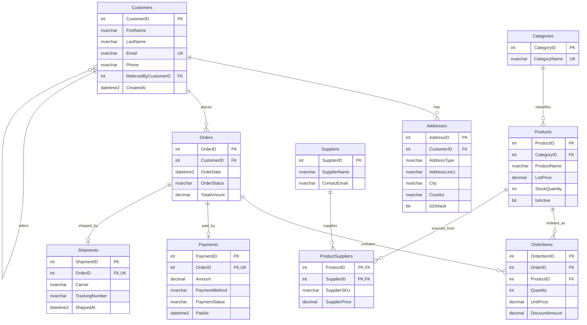

# MS SQL Server Relational Database Design

## Joins, Foreign Keys, Normalization, and Database Architecture Basics


The database used in this lecture is named:

```sql
ECommerceLectureDB
```

Main tables:

| Table | Purpose |
|---|---|
| `Customers` | Stores customer accounts |
| `Addresses` | Stores customer addresses |
| `Orders` | Stores customer orders |
| `OrderItems` | Stores products inside orders |
| `Products` | Stores product catalog data |
| `Categories` | Stores product categories |
| `Suppliers` | Stores supplier information |
| `ProductSuppliers` | Junction table for product-supplier many-to-many relation |
| `Payments` | Stores payment information |
| `Shipments` | Stores shipment information |

---

## Joined tables

### One-to-many relationships

The database contains several one-to-many relationships.

| Parent table | Child table | Meaning |
|---|---|---|
| `Customers` | `Orders` | One customer can place many orders |
| `Customers` | `Addresses` | One customer can have many addresses |
| `Orders` | `OrderItems` | One order can contain many order lines |
| `Categories` | `Products` | One category can contain many products |

### Many-to-many relationship

The database also contains one many-to-many relationship.

| Table A | Table B | Junction table |
|---|---|---|
| `Products` | `Suppliers` | `ProductSuppliers` |

Meaning:

- one product can be supplied by many suppliers;
- one supplier can supply many products.

SQL Server does not directly store a many-to-many relationship in two tables. We model it using a third table called a **junction table**, **bridge table**, or **associative table**.

---

##  ERD - Entity Relations Diagram



---

# Part I — Full SQL Server database script

## How to run the script

Open **SQL Server Management Studio** or **Azure Data Studio**, connect to SQL Server, and run the following script.

The script will:

1. drop the database if it already exists;
2. create a fresh database;
3. create normalized tables;
4. create primary keys, foreign keys, unique constraints, and check constraints;
5. create useful indexes;
6. populate lookup tables;
7. populate production-like random data;
8. generate more than 100 orders;
9. generate order items, payments, and shipments;
10. verify the row counts.

---

## Full create-and-populate script

```sql


/* ============================================================
	1. CREATE TABLES
============================================================ */

CREATE TABLE dbo.Customers (
	CustomerID int IDENTITY(1,1) NOT NULL,
	FirstName nvarchar(50) NOT NULL,
	LastName nvarchar(50) NOT NULL,
	Email nvarchar(255) NOT NULL,
	Phone nvarchar(30) NULL,
	ReferredByCustomerID int NULL,
	CreatedAt datetime2(0) NOT NULL CONSTRAINT DF_Customers_CreatedAt DEFAULT SYSDATETIME(),
	CONSTRAINT PK_Customers PRIMARY KEY (CustomerID),
	CONSTRAINT UQ_Customers_Email UNIQUE (Email)
);
GO

CREATE TABLE dbo.Addresses (
	AddressID int IDENTITY(1,1) NOT NULL,
	CustomerID int NOT NULL,
	AddressType nvarchar(20) NOT NULL,
	AddressLine1 nvarchar(200) NOT NULL,
	City nvarchar(80) NOT NULL,
	Country nvarchar(80) NOT NULL,
	PostalCode nvarchar(20) NULL,
	IsDefault bit NOT NULL CONSTRAINT DF_Addresses_IsDefault DEFAULT 0,
	CONSTRAINT PK_Addresses PRIMARY KEY (AddressID),
	CONSTRAINT CK_Addresses_AddressType CHECK (AddressType IN (N'Home', N'Billing', N'Shipping'))
);
GO

CREATE TABLE dbo.Categories (
	CategoryID int IDENTITY(1,1) NOT NULL,
	CategoryName nvarchar(80) NOT NULL,
	CONSTRAINT PK_Categories PRIMARY KEY (CategoryID),
	CONSTRAINT UQ_Categories_CategoryName UNIQUE (CategoryName)
);
GO

CREATE TABLE dbo.Products (
	ProductID int IDENTITY(1,1) NOT NULL,
	CategoryID int NOT NULL,
	ProductName nvarchar(120) NOT NULL,
	ListPrice decimal(10,2) NOT NULL,
	StockQuantity int NOT NULL,
	IsActive bit NOT NULL CONSTRAINT DF_Products_IsActive DEFAULT 1,
	CreatedAt datetime2(0) NOT NULL CONSTRAINT DF_Products_CreatedAt DEFAULT SYSDATETIME(),
	CONSTRAINT PK_Products PRIMARY KEY (ProductID),
	CONSTRAINT CK_Products_ListPrice CHECK (ListPrice >= 0),
	CONSTRAINT CK_Products_StockQuantity CHECK (StockQuantity >= 0)
);
GO

CREATE TABLE dbo.Suppliers (
	SupplierID int IDENTITY(1,1) NOT NULL,
	SupplierName nvarchar(120) NOT NULL,
	ContactEmail nvarchar(255) NOT NULL,
	Phone nvarchar(30) NULL,
	CONSTRAINT PK_Suppliers PRIMARY KEY (SupplierID),
	CONSTRAINT UQ_Suppliers_ContactEmail UNIQUE (ContactEmail)
);
GO

CREATE TABLE dbo.ProductSuppliers (
	ProductID int NOT NULL,
	SupplierID int NOT NULL,
	SupplierSKU nvarchar(50) NOT NULL,
	SupplierPrice decimal(10,2) NOT NULL,
	LeadTimeDays int NOT NULL,
	CONSTRAINT PK_ProductSuppliers PRIMARY KEY (ProductID, SupplierID),
	CONSTRAINT CK_ProductSuppliers_SupplierPrice CHECK (SupplierPrice >= 0),
	CONSTRAINT CK_ProductSuppliers_LeadTimeDays CHECK (LeadTimeDays >= 0)
);
GO

CREATE TABLE dbo.Orders (
	OrderID int IDENTITY(1,1) NOT NULL,
	CustomerID int NOT NULL,
	OrderDate datetime2(0) NOT NULL,
	OrderStatus nvarchar(20) NOT NULL,
	TotalAmount decimal(12,2) NOT NULL CONSTRAINT DF_Orders_TotalAmount DEFAULT 0,
	CreatedAt datetime2(0) NOT NULL CONSTRAINT DF_Orders_CreatedAt DEFAULT SYSDATETIME(),
	CONSTRAINT PK_Orders PRIMARY KEY (OrderID),
	CONSTRAINT CK_Orders_OrderStatus CHECK (OrderStatus IN (N'Pending', N'Completed', N'Cancelled', N'Shipped')),
	CONSTRAINT CK_Orders_TotalAmount CHECK (TotalAmount >= 0)
);
GO

CREATE TABLE dbo.OrderItems (
	OrderItemID int IDENTITY(1,1) NOT NULL,
	OrderID int NOT NULL,
	ProductID int NOT NULL,
	Quantity int NOT NULL,
	UnitPrice decimal(10,2) NOT NULL,
	DiscountAmount decimal(10,2) NOT NULL CONSTRAINT DF_OrderItems_DiscountAmount DEFAULT 0,
	CONSTRAINT PK_OrderItems PRIMARY KEY (OrderItemID),
	CONSTRAINT CK_OrderItems_Quantity CHECK (Quantity > 0),
	CONSTRAINT CK_OrderItems_UnitPrice CHECK (UnitPrice >= 0),
	CONSTRAINT CK_OrderItems_DiscountAmount CHECK (DiscountAmount >= 0)
);
GO

CREATE TABLE dbo.Payments (
	PaymentID int IDENTITY(1,1) NOT NULL,
	OrderID int NOT NULL,
	Amount decimal(12,2) NOT NULL,
	PaymentMethod nvarchar(30) NOT NULL,
	PaymentStatus nvarchar(20) NOT NULL,
	PaidAt datetime2(0) NULL,
	CONSTRAINT PK_Payments PRIMARY KEY (PaymentID),
	CONSTRAINT UQ_Payments_OrderID UNIQUE (OrderID),
	CONSTRAINT CK_Payments_Amount CHECK (Amount >= 0),
	CONSTRAINT CK_Payments_PaymentMethod CHECK (PaymentMethod IN (N'Card', N'Bank Transfer', N'Cash', N'PayPal')),
	CONSTRAINT CK_Payments_PaymentStatus CHECK (PaymentStatus IN (N'Pending', N'Paid', N'Failed', N'Refunded'))
);
GO

CREATE TABLE dbo.Shipments (
	ShipmentID int IDENTITY(1,1) NOT NULL,
	OrderID int NOT NULL,
	Carrier nvarchar(50) NOT NULL,
	TrackingNumber nvarchar(80) NOT NULL,
	ShippedAt datetime2(0) NOT NULL,
	DeliveredAt datetime2(0) NULL,
	CONSTRAINT PK_Shipments PRIMARY KEY (ShipmentID),
	CONSTRAINT UQ_Shipments_OrderID UNIQUE (OrderID),
	CONSTRAINT UQ_Shipments_TrackingNumber UNIQUE (TrackingNumber)
);
GO

/* ============================================================
	2. ADD FOREIGN KEYS
============================================================ */

ALTER TABLE dbo.Customers
ADD CONSTRAINT FK_Customers_ReferredByCustomer
FOREIGN KEY (ReferredByCustomerID)
REFERENCES dbo.Customers(CustomerID);
GO

ALTER TABLE dbo.Addresses
ADD CONSTRAINT FK_Addresses_Customers
FOREIGN KEY (CustomerID)
REFERENCES dbo.Customers(CustomerID)
ON DELETE CASCADE;
GO

ALTER TABLE dbo.Products
ADD CONSTRAINT FK_Products_Categories
FOREIGN KEY (CategoryID)
REFERENCES dbo.Categories(CategoryID);
GO

ALTER TABLE dbo.ProductSuppliers
ADD CONSTRAINT FK_ProductSuppliers_Products
FOREIGN KEY (ProductID)
REFERENCES dbo.Products(ProductID);
GO

ALTER TABLE dbo.ProductSuppliers
ADD CONSTRAINT FK_ProductSuppliers_Suppliers
FOREIGN KEY (SupplierID)
REFERENCES dbo.Suppliers(SupplierID);
GO

ALTER TABLE dbo.Orders
ADD CONSTRAINT FK_Orders_Customers
FOREIGN KEY (CustomerID)
REFERENCES dbo.Customers(CustomerID);
GO

ALTER TABLE dbo.OrderItems
ADD CONSTRAINT FK_OrderItems_Orders
FOREIGN KEY (OrderID)
REFERENCES dbo.Orders(OrderID);
GO

ALTER TABLE dbo.OrderItems
ADD CONSTRAINT FK_OrderItems_Products
FOREIGN KEY (ProductID)
REFERENCES dbo.Products(ProductID);
GO

ALTER TABLE dbo.Payments
ADD CONSTRAINT FK_Payments_Orders
FOREIGN KEY (OrderID)
REFERENCES dbo.Orders(OrderID);
GO

ALTER TABLE dbo.Shipments
ADD CONSTRAINT FK_Shipments_Orders
FOREIGN KEY (OrderID)
REFERENCES dbo.Orders(OrderID);
GO

/* ============================================================
	3. CREATE INDEXES
============================================================ */

CREATE INDEX IX_Addresses_CustomerID ON dbo.Addresses(CustomerID);
CREATE INDEX IX_Products_CategoryID ON dbo.Products(CategoryID);
CREATE INDEX IX_ProductSuppliers_SupplierID ON dbo.ProductSuppliers(SupplierID);
CREATE INDEX IX_Orders_CustomerID ON dbo.Orders(CustomerID);
CREATE INDEX IX_Orders_OrderDate ON dbo.Orders(OrderDate);
CREATE INDEX IX_OrderItems_OrderID ON dbo.OrderItems(OrderID);
CREATE INDEX IX_OrderItems_ProductID ON dbo.OrderItems(ProductID);
CREATE INDEX IX_Payments_OrderID ON dbo.Payments(OrderID);
CREATE INDEX IX_Shipments_OrderID ON dbo.Shipments(OrderID);
GO

/* ============================================================
	4. INSERT LOOKUP DATA
============================================================ */

INSERT INTO dbo.Categories (CategoryName)
VALUES
	(N'Computers'),
	(N'Phones'),
	(N'Accessories'),
	(N'Office'),
	(N'Gaming'),
	(N'Networking'),
	(N'Audio'),
	(N'Storage');
GO

INSERT INTO dbo.Suppliers (SupplierName, ContactEmail, Phone)
VALUES
	(N'Northwind Hardware', N'contact@northwind-hardware.test', N'+1-555-1001'),
	(N'BluePeak Distribution', N'sales@bluepeak.test', N'+1-555-1002'),
	(N'TechNova Wholesale', N'orders@technova.test', N'+1-555-1003'),
	(N'Global Office Supply', N'hello@globaloffice.test', N'+1-555-1004'),
	(N'SmartLink Imports', N'supply@smartlink.test', N'+1-555-1005'),
	(N'Quantum Retail Group', N'b2b@quantumretail.test', N'+1-555-1006'),
	(N'Metro Components', N'contact@metrocomponents.test', N'+1-555-1007'),
	(N'CloudNine Electronics', N'partners@cloudnine.test', N'+1-555-1008'),
	(N'DigitalBridge Supply', N'info@digitalbridge.test', N'+1-555-1009'),
	(N'CoreTech Partners', N'sales@coretech.test', N'+1-555-1010');
GO

/* ============================================================
	5. INSERT PRODUCTS
============================================================ */

DECLARE @p int = 1;

WHILE @p <= 30
BEGIN
	INSERT INTO dbo.Products (CategoryID, ProductName, ListPrice, StockQuantity, IsActive)
	VALUES (
		1 + ABS(CHECKSUM(NEWID())) % 8,
		CASE @p
			WHEN 1 THEN N'Laptop Pro 14'
			WHEN 2 THEN N'Laptop Air 13'
			WHEN 3 THEN N'USB-C Docking Station'
			WHEN 4 THEN N'Wireless Mouse'
			WHEN 5 THEN N'Mechanical Keyboard'
			WHEN 6 THEN N'27 Inch Monitor'
			WHEN 7 THEN N'Gaming Headset'
			WHEN 8 THEN N'Bluetooth Speaker'
			WHEN 9 THEN N'External SSD 1TB'
			WHEN 10 THEN N'External HDD 4TB'
			WHEN 11 THEN N'Wi-Fi Router AX3000'
			WHEN 12 THEN N'Network Switch 8 Port'
			WHEN 13 THEN N'Office Chair'
			WHEN 14 THEN N'Webcam Full HD'
			WHEN 15 THEN N'USB Flash Drive 128GB'
			WHEN 16 THEN N'Smartphone Lite'
			WHEN 17 THEN N'Smartphone Max'
			WHEN 18 THEN N'Tablet 10 Inch'
			WHEN 19 THEN N'Graphics Card Entry'
			WHEN 20 THEN N'Gaming Controller'
			WHEN 21 THEN N'Noise Cancelling Earbuds'
			WHEN 22 THEN N'Portable Charger'
			WHEN 23 THEN N'HDMI Cable 2m'
			WHEN 24 THEN N'Laptop Stand'
			WHEN 25 THEN N'Ergonomic Desk Mat'
			WHEN 26 THEN N'NAS Enclosure 2 Bay'
			WHEN 27 THEN N'MicroSD Card 256GB'
			WHEN 28 THEN N'Printer Laser Mono'
			WHEN 29 THEN N'Scanner Compact'
			ELSE N'Smartwatch Basic'
		END,
		CAST(10 + ABS(CHECKSUM(NEWID())) % 1490 + ((ABS(CHECKSUM(NEWID())) % 99) / 100.0) AS decimal(10,2)),
		10 + ABS(CHECKSUM(NEWID())) % 300,
		CASE WHEN @p % 17 = 0 THEN 0 ELSE 1 END
	);

	SET @p += 1;
END;
GO

/* ============================================================
	6. INSERT CUSTOMERS
============================================================ */

DECLARE @i int = 1;

WHILE @i <= 40
BEGIN
	INSERT INTO dbo.Customers (FirstName, LastName, Email, Phone, CreatedAt)
	VALUES (
		CASE ABS(CHECKSUM(NEWID())) % 10
			WHEN 0 THEN N'Anna'
			WHEN 1 THEN N'Giorgi'
			WHEN 2 THEN N'Mariam'
			WHEN 3 THEN N'Nika'
			WHEN 4 THEN N'Sophia'
			WHEN 5 THEN N'David'
			WHEN 6 THEN N'Elene'
			WHEN 7 THEN N'Luka'
			WHEN 8 THEN N'Tamar'
			ELSE N'Sandro'
		END,
		CASE ABS(CHECKSUM(NEWID())) % 10
			WHEN 0 THEN N'Smith'
			WHEN 1 THEN N'Johnson'
			WHEN 2 THEN N'Brown'
			WHEN 3 THEN N'Davis'
			WHEN 4 THEN N'Miller'
			WHEN 5 THEN N'Wilson'
			WHEN 6 THEN N'Taylor'
			WHEN 7 THEN N'Anderson'
			WHEN 8 THEN N'Martin'
			ELSE N'Clark'
		END,
		CONCAT(N'customer', @i, N'@example.test'),
		CONCAT(N'+995-555-', RIGHT(CONCAT(N'0000', @i), 4)),
		DATEADD(day, -ABS(CHECKSUM(NEWID())) % 1000, SYSDATETIME())
	);

	SET @i += 1;
END;
GO

UPDATE dbo.Customers
SET ReferredByCustomerID = CASE 
	WHEN CustomerID > 1 AND CustomerID % 4 = 0 THEN CustomerID - 1
	WHEN CustomerID > 2 AND CustomerID % 7 = 0 THEN CustomerID - 2
	ELSE NULL
END;
GO

/* ============================================================
	7. INSERT ADDRESSES
============================================================ */

DECLARE @c int = 1;
DECLARE @maxCustomer int = (SELECT MAX(CustomerID) FROM dbo.Customers);

WHILE @c <= @maxCustomer
BEGIN
	INSERT INTO dbo.Addresses (CustomerID, AddressType, AddressLine1, City, Country, PostalCode, IsDefault)
	VALUES (
		@c,
		N'Home',
		CONCAT(N'Building ', 1 + ABS(CHECKSUM(NEWID())) % 200, N', Main Street'),
		CASE ABS(CHECKSUM(NEWID())) % 6
			WHEN 0 THEN N'Tbilisi'
			WHEN 1 THEN N'Batumi'
			WHEN 2 THEN N'Kutaisi'
			WHEN 3 THEN N'Rustavi'
			WHEN 4 THEN N'Berlin'
			ELSE N'Prague'
		END,
		CASE ABS(CHECKSUM(NEWID())) % 3
			WHEN 0 THEN N'Georgia'
			WHEN 1 THEN N'Germany'
			ELSE N'Czech Republic'
		END,
		CONCAT(N'ZIP', RIGHT(CONCAT(N'00000', @c), 5)),
		1
	);

	IF @c % 2 = 0
	BEGIN
		INSERT INTO dbo.Addresses (CustomerID, AddressType, AddressLine1, City, Country, PostalCode, IsDefault)
		VALUES (
			@c,
			N'Billing',
			CONCAT(N'Office ', 1 + ABS(CHECKSUM(NEWID())) % 100, N', Business Avenue'),
			CASE ABS(CHECKSUM(NEWID())) % 4
				WHEN 0 THEN N'Tbilisi'
				WHEN 1 THEN N'Batumi'
				WHEN 2 THEN N'Warsaw'
				ELSE N'Vienna'
			END,
			CASE ABS(CHECKSUM(NEWID())) % 3
				WHEN 0 THEN N'Georgia'
				WHEN 1 THEN N'Poland'
				ELSE N'Austria'
			END,
			CONCAT(N'BILL', RIGHT(CONCAT(N'00000', @c), 5)),
			0
		);
	END;

	SET @c += 1;
END;
GO

/* ============================================================
	8. INSERT PRODUCT-SUPPLIER MANY-TO-MANY DATA
============================================================ */

INSERT INTO dbo.ProductSuppliers (ProductID, SupplierID, SupplierSKU, SupplierPrice, LeadTimeDays)
SELECT
	p.ProductID,
	((p.ProductID - 1) % 10) + 1 AS SupplierID,
	CONCAT(N'SKU-', p.ProductID, N'-A'),
	CAST(p.ListPrice * 0.70 AS decimal(10,2)),
	2 + ABS(CHECKSUM(NEWID())) % 10
FROM dbo.Products p;

INSERT INTO dbo.ProductSuppliers (ProductID, SupplierID, SupplierSKU, SupplierPrice, LeadTimeDays)
SELECT
	p.ProductID,
	((p.ProductID + 2) % 10) + 1 AS SupplierID,
	CONCAT(N'SKU-', p.ProductID, N'-B'),
	CAST(p.ListPrice * 0.76 AS decimal(10,2)),
	3 + ABS(CHECKSUM(NEWID())) % 12
FROM dbo.Products p;
GO

/* ============================================================
	9. INSERT 120 ORDERS
============================================================ */

DECLARE @o int = 1;
DECLARE @customerCount int = (SELECT COUNT(*) FROM dbo.Customers);

WHILE @o <= 120
BEGIN
	INSERT INTO dbo.Orders (CustomerID, OrderDate, OrderStatus, TotalAmount)
	VALUES (
		1 + ABS(CHECKSUM(NEWID())) % @customerCount,
		DATEADD(day, -ABS(CHECKSUM(NEWID())) % 365, SYSDATETIME()),
		CASE ABS(CHECKSUM(NEWID())) % 4
			WHEN 0 THEN N'Pending'
			WHEN 1 THEN N'Completed'
			WHEN 2 THEN N'Cancelled'
			ELSE N'Shipped'
		END,
		0
	);

	SET @o += 1;
END;
GO

/* ============================================================
	10. INSERT ORDER ITEMS
============================================================ */

DECLARE @orderID int = 1;
DECLARE @maxOrderID int = (SELECT MAX(OrderID) FROM dbo.Orders);
DECLARE @maxProductID int = (SELECT MAX(ProductID) FROM dbo.Products);
DECLARE @itemsForOrder int;
DECLARE @line int;
DECLARE @productID int;
DECLARE @price decimal(10,2);
DECLARE @quantity int;
DECLARE @discount decimal(10,2);

WHILE @orderID <= @maxOrderID
BEGIN
	SET @itemsForOrder = 1 + ABS(CHECKSUM(NEWID())) % 5;
	SET @line = 1;

	WHILE @line <= @itemsForOrder
	BEGIN
		SET @productID = 1 + ABS(CHECKSUM(NEWID())) % @maxProductID;
		SELECT @price = ListPrice FROM dbo.Products WHERE ProductID = @productID;
		SET @quantity = 1 + ABS(CHECKSUM(NEWID())) % 4;
		SET @discount = CASE 
			WHEN ABS(CHECKSUM(NEWID())) % 5 = 0 THEN CAST(@price * 0.10 AS decimal(10,2))
			ELSE 0
		END;

		INSERT INTO dbo.OrderItems (OrderID, ProductID, Quantity, UnitPrice, DiscountAmount)
		VALUES (@orderID, @productID, @quantity, @price, @discount);

		SET @line += 1;
	END;

	SET @orderID += 1;
END;
GO

/* ============================================================
	11. UPDATE ORDER TOTALS FROM ORDER ITEMS
============================================================ */

UPDATE o
SET TotalAmount = x.OrderTotal
FROM dbo.Orders o
JOIN (
	SELECT
		OrderID,
		CAST(SUM((Quantity * UnitPrice) - DiscountAmount) AS decimal(12,2)) AS OrderTotal
	FROM dbo.OrderItems
	GROUP BY OrderID
) x ON o.OrderID = x.OrderID;
GO

/* ============================================================
	12. INSERT PAYMENTS
============================================================ */

INSERT INTO dbo.Payments (OrderID, Amount, PaymentMethod, PaymentStatus, PaidAt)
SELECT
	OrderID,
	CASE WHEN OrderStatus = N'Cancelled' THEN 0 ELSE TotalAmount END AS Amount,
	CASE ABS(CHECKSUM(NEWID())) % 4
		WHEN 0 THEN N'Card'
		WHEN 1 THEN N'Bank Transfer'
		WHEN 2 THEN N'Cash'
		ELSE N'PayPal'
	END AS PaymentMethod,
	CASE OrderStatus
		WHEN N'Completed' THEN N'Paid'
		WHEN N'Shipped' THEN N'Paid'
		WHEN N'Cancelled' THEN N'Refunded'
		ELSE N'Pending'
	END AS PaymentStatus,
	CASE 
		WHEN OrderStatus IN (N'Completed', N'Shipped') THEN DATEADD(hour, 1 + ABS(CHECKSUM(NEWID())) % 48, OrderDate)
		ELSE NULL
	END AS PaidAt
FROM dbo.Orders;
GO

/* ============================================================
	13. INSERT SHIPMENTS
============================================================ */

INSERT INTO dbo.Shipments (OrderID, Carrier, TrackingNumber, ShippedAt, DeliveredAt)
SELECT
	OrderID,
	CASE ABS(CHECKSUM(NEWID())) % 4
		WHEN 0 THEN N'DHL'
		WHEN 1 THEN N'UPS'
		WHEN 2 THEN N'FedEx'
		ELSE N'Local Courier'
	END AS Carrier,
	CONCAT(N'TRK-', OrderID, N'-', ABS(CHECKSUM(NEWID())) % 1000000) AS TrackingNumber,
	DATEADD(day, 1 + ABS(CHECKSUM(NEWID())) % 5, OrderDate) AS ShippedAt,
	CASE 
		WHEN OrderStatus = N'Completed' THEN DATEADD(day, 6 + ABS(CHECKSUM(NEWID())) % 10, OrderDate)
		ELSE NULL
	END AS DeliveredAt
FROM dbo.Orders
WHERE OrderStatus IN (N'Completed', N'Shipped');
GO

/* ============================================================
	14. VERIFY ROW COUNTS
============================================================ */

SELECT 'Customers' AS TableName, COUNT(*) AS RowCount FROM dbo.Customers
UNION ALL SELECT 'Addresses', COUNT(*) FROM dbo.Addresses
UNION ALL SELECT 'Categories', COUNT(*) FROM dbo.Categories
UNION ALL SELECT 'Products', COUNT(*) FROM dbo.Products
UNION ALL SELECT 'Suppliers', COUNT(*) FROM dbo.Suppliers
UNION ALL SELECT 'ProductSuppliers', COUNT(*) FROM dbo.ProductSuppliers
UNION ALL SELECT 'Orders', COUNT(*) FROM dbo.Orders
UNION ALL SELECT 'OrderItems', COUNT(*) FROM dbo.OrderItems
UNION ALL SELECT 'Payments', COUNT(*) FROM dbo.Payments
UNION ALL SELECT 'Shipments', COUNT(*) FROM dbo.Shipments;
GO
```

---

# Part II — Relational database theory with SQL Server examples

## Again, what is a relational database?

A relational database stores data in tables. A table represents one type of entity, such as customers, products, or orders.

A table has:

- columns, which define attributes;
- rows, which store individual records;
- keys, which identify and connect rows;
- constraints, which protect data quality.

Example:

```sql
SELECT TOP 10 *
FROM dbo.Customers;
```

In relational theory:

| Relational term | Common SQL term |
|---|---|
| Relation | Table |
| Tuple | Row |
| Attribute | Column |
| Domain | Allowed values/data type |
| Candidate key | Possible unique identifier |
| Primary key | Chosen unique identifier |
| Foreign key | Reference to another table |

SQL Server metadata example:

```sql
EXEC sp_help 'dbo.Customers';
```

Another way to inspect columns:

```sql
SELECT
	COLUMN_NAME,
	DATA_TYPE,
	IS_NULLABLE
FROM INFORMATION_SCHEMA.COLUMNS
WHERE TABLE_NAME = 'Customers';
```

---


## Unique constraints

A table can have one primary key, but it can also have other unique constraints.

In `Customers`, `Email` is unique:

```sql
CONSTRAINT UQ_Customers_Email UNIQUE (Email)
```

This prevents two customers from having the same email.

Example:

```sql
SELECT
	Email,
	COUNT(*) AS EmailCount
FROM dbo.Customers
GROUP BY Email
HAVING COUNT(*) > 1;
```

This should return no rows.

Trying to insert duplicate email:

```sql
INSERT INTO dbo.Customers (FirstName, LastName, Email, Phone)
VALUES (N'Test', N'Duplicate', N'customer1@example.test', N'+995-555-9999');
```

Expected result: SQL Server rejects the insert because of the unique constraint.

---

## 13. Foreign keys

A foreign key connects a child table to a parent table.

Example:

```sql
ALTER TABLE dbo.Orders
ADD CONSTRAINT FK_Orders_Customers
FOREIGN KEY (CustomerID)
REFERENCES dbo.Customers(CustomerID);
```

This means:

- every `Orders.CustomerID` must refer to an existing `Customers.CustomerID`;
- SQL Server prevents orders for nonexistent customers.

Join example:

```sql
SELECT
	o.OrderID,
	o.OrderDate,
	o.OrderStatus,
	c.CustomerID,
	c.FirstName,
	c.LastName
FROM dbo.Orders o
JOIN dbo.Customers c ON o.CustomerID = c.CustomerID;
```

Foreign key violation example:

```sql
INSERT INTO dbo.Orders (CustomerID, OrderDate, OrderStatus, TotalAmount)
VALUES (999999, SYSDATETIME(), N'Pending', 100.00);
```

Expected result: SQL Server rejects the row because customer `999999` does not exist.

---

## Referential integrity

Referential integrity means relationships between tables remain valid.

For example, an order should not point to a nonexistent customer.

Find all orders and their customers:

```sql
SELECT
	o.OrderID,
	o.CustomerID,
	c.Email
FROM dbo.Orders o
JOIN dbo.Customers c ON o.CustomerID = c.CustomerID;
```

Check whether invalid orders exist:

```sql
SELECT
	o.OrderID,
	o.CustomerID
FROM dbo.Orders o
LEFT JOIN dbo.Customers c ON o.CustomerID = c.CustomerID
WHERE c.CustomerID IS NULL;
```

This should return no rows because the foreign key prevents invalid references.

---

## One-to-many relationship

A one-to-many relationship means one row in a parent table can be connected to many rows in a child table.

Example:

```text
Customers 1 ---- many Orders
```

One customer can place many orders.

SQL example:

```sql
SELECT
	c.CustomerID,
	c.FirstName,
	c.LastName,	o.OrderID,
	o.OrderDate,
	o.TotalAmount
FROM dbo.Customers c
JOIN dbo.Orders o ON c.CustomerID = o.CustomerID
ORDER BY c.CustomerID, o.OrderDate;
```

Count orders per customer:

```sql
SELECT
	c.CustomerID,
	c.FirstName,
	c.LastName,
	COUNT(o.OrderID) AS OrderCount
FROM dbo.Customers c
LEFT JOIN dbo.Orders o ON c.CustomerID = o.CustomerID
GROUP BY c.CustomerID, c.FirstName, c.LastName
ORDER BY OrderCount DESC;
```

Why use `LEFT JOIN` here? Because we may want to show customers even if they have zero orders.

---

## Second one-to-many relationship: orders and order items

An order usually contains many products. We should not store `Product1`, `Product2`, and `Product3` columns inside `Orders`.

Instead, we use `OrderItems`.

```text
Orders 1 ---- many OrderItems
```

Example:

```sql
SELECT
	o.OrderID,
	o.OrderDate,
	p.ProductName,
	oi.Quantity,
	oi.UnitPrice,
	oi.DiscountAmount,
	(oi.Quantity * oi.UnitPrice) - oi.DiscountAmount AS LineTotal
FROM dbo.Orders o
JOIN dbo.OrderItems oi ON o.OrderID = oi.OrderID
JOIN dbo.Products p ON oi.ProductID = p.ProductID
WHERE o.OrderID = 1;
```

This design allows each order to contain any number of products.

---

## Third one-to-many relationship: customers and addresses

A customer can have more than one address.

```text
Customers 1 ---- many Addresses
```

Example:

```sql
SELECT
	c.CustomerID,
	c.FirstName,
	c.LastName,
	a.AddressType,
	a.AddressLine1,
	a.City,
	a.Country
FROM dbo.Customers c
JOIN dbo.Addresses a ON c.CustomerID = a.CustomerID
ORDER BY c.CustomerID;
```

Find customers with more than one address:

```sql
SELECT
	c.CustomerID,
	c.FirstName,
	c.LastName,
	COUNT(a.AddressID) AS AddressCount
FROM dbo.Customers c
JOIN dbo.Addresses a ON c.CustomerID = a.CustomerID
GROUP BY c.CustomerID, c.FirstName, c.LastName
HAVING COUNT(a.AddressID) > 1;
```

---

## Many-to-many relationship

A many-to-many relationship occurs when many rows in table A can relate to many rows in table B.

Example:

```text
Products many ---- many Suppliers
```

A product can have several suppliers. A supplier can supply several products.

In relational databases, this is implemented using a junction table:

```text
Products 1 ---- many ProductSuppliers many ---- 1 Suppliers
```

Query:

```sql
SELECT
	p.ProductID,
	p.ProductName,
	s.SupplierID,
	s.SupplierName,
	ps.SupplierSKU,
	ps.SupplierPrice,
	ps.LeadTimeDays
FROM dbo.Products p
JOIN dbo.ProductSuppliers ps ON p.ProductID = ps.ProductID
JOIN dbo.Suppliers s ON ps.SupplierID = s.SupplierID
ORDER BY p.ProductID, s.SupplierName;
```

Count suppliers per product:

```sql
SELECT
	p.ProductID,
	p.ProductName,
	COUNT(ps.SupplierID) AS SupplierCount
FROM dbo.Products p
LEFT JOIN dbo.ProductSuppliers ps ON p.ProductID = ps.ProductID
GROUP BY p.ProductID, p.ProductName
ORDER BY SupplierCount DESC;
```

Count products per supplier:

```sql
SELECT
	s.SupplierID,
	s.SupplierName,
	COUNT(ps.ProductID) AS ProductCount
FROM dbo.Suppliers s
LEFT JOIN dbo.ProductSuppliers ps ON s.SupplierID = ps.SupplierID
GROUP BY s.SupplierID, s.SupplierName
ORDER BY ProductCount DESC;
```

---

# Part III — Normalization

## What is normalization?

Normalization is the process of organizing data into related tables to reduce duplication and improve data integrity.

A normalized design tries to store each fact once.

For example, customer email should be stored in `Customers`, not repeated in every order row.

---

## Unnormalized design example

Bad design:

```sql
CREATE TABLE dbo.BadOrders (
	OrderID int,
	CustomerName nvarchar(100),
	CustomerEmail nvarchar(255),
	Product1 nvarchar(100),
	Product1Quantity int,
	Product2 nvarchar(100),
	Product2Quantity int,
	Product3 nvarchar(100),
	Product3Quantity int
);
```

Problems:

1. What if an order has four products?
2. What if an order has only one product?
3. Searching by product becomes difficult.
4. Product names are duplicated.
5. Customer email is repeated in many rows.
6. Updating customer email requires updating many rows.

Example of awkward query:

```sql
SELECT *
FROM dbo.BadOrders
WHERE Product1 = N'Laptop Pro 14'
   OR Product2 = N'Laptop Pro 14'
   OR Product3 = N'Laptop Pro 14';
```

This is a warning sign that the design is not relational enough.

---

## First Normal Form, 1NF

A table is in First Normal Form when:

- each column contains atomic values;
- there are no repeating groups;
- each row is uniquely identifiable.

Bad 1NF example:

```text
OrderID | CustomerEmail | Products
1       | a@test.com    | Laptop, Mouse, Keyboard
```

The `Products` column contains multiple values.

Better design:

```text
Orders
OrderItems
Products
```

SQL query using normalized tables:

```sql
SELECT
	o.OrderID,
	c.Email,
	p.ProductName,
	oi.Quantity
FROM dbo.Orders o
JOIN dbo.Customers c ON o.CustomerID = c.CustomerID
JOIN dbo.OrderItems oi ON o.OrderID = oi.OrderID
JOIN dbo.Products p ON oi.ProductID = p.ProductID
ORDER BY o.OrderID;
```

---

## Second Normal Form, 2NF

Second Normal Form means:

- the table is already in 1NF;
- every non-key column depends on the whole primary key, not only part of it.

This mostly matters when a table has a composite primary key.

Example from this database:

```sql
ProductSuppliers(ProductID, SupplierID, SupplierSKU, SupplierPrice, LeadTimeDays)
```

The primary key is:

```sql
(ProductID, SupplierID)
```

Good columns:

- `SupplierSKU` depends on the combination of product and supplier;
- `SupplierPrice` depends on the combination of product and supplier;
- `LeadTimeDays` depends on the combination of product and supplier.

Bad design would be:

```text
ProductID | SupplierID | ProductName | SupplierName | SupplierPrice
```

Why bad?

- `ProductName` depends only on `ProductID`;
- `SupplierName` depends only on `SupplierID`;
- only `SupplierPrice` depends on the full pair.

Correct query with normalized tables:

```sql
SELECT
	p.ProductName,
	s.SupplierName,
	ps.SupplierSKU,
	ps.SupplierPrice
FROM dbo.ProductSuppliers ps
JOIN dbo.Products p ON ps.ProductID = p.ProductID
JOIN dbo.Suppliers s ON ps.SupplierID = s.SupplierID;
```

---

## Third Normal Form, 3NF

Third Normal Form means:

- the table is already in 2NF;
- non-key columns do not depend on other non-key columns.

Bad design:

```text
OrderID | CustomerID | CustomerEmail | CustomerPhone
```

Here, `CustomerEmail` and `CustomerPhone` depend on `CustomerID`, not directly on `OrderID`.

Better design:

```text
Customers(CustomerID, Email, Phone)
Orders(OrderID, CustomerID, OrderDate)
```

Query:

```sql
SELECT
	o.OrderID,
	o.OrderDate,
	c.Email,
	c.Phone
FROM dbo.Orders o
JOIN dbo.Customers c ON o.CustomerID = c.CustomerID;
```

---

## 24. Insert, update, and delete anomalies

Poor normalization creates anomalies.

### Insert anomaly

If customer data is stored only inside orders, we cannot add a customer until they place an order.

Normalized solution:

```sql
INSERT INTO dbo.Customers (FirstName, LastName, Email, Phone)
VALUES (N'New', N'Customer', N'new.customer@example.test', N'+995-555-2222');
```

No order is required.

### Update anomaly

If customer email is repeated in every order, changing email requires many updates.

Normalized solution:

```sql
UPDATE dbo.Customers
SET Email = N'updated.customer@example.test'
WHERE CustomerID = 1;
```

Only one row changes.

### Delete anomaly

If customer information is stored only in orders, deleting the last order may delete the only copy of the customer information.

Normalized solution: keep customer and order data separate.

```sql
SELECT *
FROM dbo.Customers
WHERE CustomerID = 1;
```

---

# Part IV — SQL Server joins

## What is a join?

A join combines rows from two or more tables using a related column.

Most joins in relational databases use primary key and foreign key columns.

Example:

```sql
SELECT
	o.OrderID,
	c.FirstName,
	c.LastName
FROM dbo.Orders o
JOIN dbo.Customers c ON o.CustomerID = c.CustomerID;
```

Here:

- `Customers.CustomerID` is the primary key;
- `Orders.CustomerID` is the foreign key;
- the join connects orders to their customers.

---

## INNER JOIN

`INNER JOIN` returns rows where both tables have matching values.

Example:

```sql
SELECT
	o.OrderID,
	o.OrderDate,
	o.OrderStatus,
	c.FirstName,
	c.LastName
FROM dbo.Orders o
INNER JOIN dbo.Customers c ON o.CustomerID = c.CustomerID;
```

Use `INNER JOIN` when you only want matching data.

Example: orders with customer information.

```sql
SELECT
	o.OrderID,
	c.Email,
	o.TotalAmount
FROM dbo.Orders o
INNER JOIN dbo.Customers c ON o.CustomerID = c.CustomerID
ORDER BY o.OrderID;
```

---

## LEFT JOIN

`LEFT JOIN` returns all rows from the left table and matching rows from the right table.

If there is no match, right-side columns become `NULL`.

Example:

```sql
SELECT
	c.CustomerID,
	c.FirstName,
	c.LastName,
	o.OrderID,
	o.TotalAmount
FROM dbo.Customers c
LEFT JOIN dbo.Orders o ON c.CustomerID = o.CustomerID
ORDER BY c.CustomerID;
```

Find customers without orders:

```sql
SELECT
	c.CustomerID,
	c.FirstName,
	c.LastName,
	c.Email
FROM dbo.Customers c
LEFT JOIN dbo.Orders o ON c.CustomerID = o.CustomerID
WHERE o.OrderID IS NULL;
```

This is one of the most common uses of `LEFT JOIN`: finding missing related data.

---

## RIGHT JOIN

`RIGHT JOIN` returns all rows from the right table and matching rows from the left table.

Example:

```sql
SELECT
	c.CustomerID,
	c.FirstName,
	c.LastName,
	o.OrderID,
	o.TotalAmount
FROM dbo.Customers c
RIGHT JOIN dbo.Orders o ON c.CustomerID = o.CustomerID;
```

In real projects, many developers prefer rewriting `RIGHT JOIN` as `LEFT JOIN` by switching the table order.

Equivalent query:

```sql
SELECT
	c.CustomerID,
	c.FirstName,
	c.LastName,
	o.OrderID,
	o.TotalAmount
FROM dbo.Orders o
LEFT JOIN dbo.Customers c ON o.CustomerID = c.CustomerID;
```

Because the foreign key protects the relationship, every order should have a customer.

---

## FULL OUTER JOIN

`FULL OUTER JOIN` returns:

- matching rows;
- rows only found in the left table;
- rows only found in the right table.

Example:

```sql
SELECT
	c.CustomerID,
	c.Email,
	o.OrderID,
	o.TotalAmount
FROM dbo.Customers c
FULL OUTER JOIN dbo.Orders o ON c.CustomerID = o.CustomerID;
```

Use case: compare two sets and show unmatched records from both sides.

A more practical example compares products and order items:

```sql
SELECT
	p.ProductID,
	p.ProductName,
	oi.OrderItemID,
	oi.OrderID
FROM dbo.Products p
FULL OUTER JOIN dbo.OrderItems oi ON p.ProductID = oi.ProductID
WHERE p.ProductID IS NULL
   OR oi.ProductID IS NULL;
```

This can help find products never ordered or order items with missing product references. In this database, missing product references should not exist because of the foreign key.

---

## CROSS JOIN

`CROSS JOIN` returns every possible combination of rows from two tables.

Example:

```sql
SELECT
	c.CategoryName,
	s.SupplierName
FROM dbo.Categories c
CROSS JOIN dbo.Suppliers s
ORDER BY c.CategoryName, s.SupplierName;
```

If there are 8 categories and 10 suppliers, the result contains:

```text
8 * 10 = 80 rows
```

Use cases:

- generating combinations;
- building test data;
- creating calendar grids;
- comparing all possible pairs.

---

## SELF JOIN

A self join joins a table to itself.

In this database, customers can refer other customers.

Column:

```sql
ReferredByCustomerID
```

Foreign key:

```sql
FOREIGN KEY (ReferredByCustomerID)
REFERENCES dbo.Customers(CustomerID)
```

Query:

```sql
SELECT
	c.CustomerID,
	c.FirstName AS CustomerFirstName,
	c.LastName AS CustomerLastName,
	ref.CustomerID AS ReferrerID,
	ref.FirstName AS ReferrerFirstName,
	ref.LastName AS ReferrerLastName
FROM dbo.Customers c
LEFT JOIN dbo.Customers ref
	ON c.ReferredByCustomerID = ref.CustomerID
ORDER BY c.CustomerID;
```

The same table appears twice using different aliases:

- `c` means the customer;
- `ref` means the referring customer.

---

## Joining more than two tables

Most real reports require several joins.

Example: full order details.

```sql
SELECT
	o.OrderID,
	o.OrderDate,
	c.Email,
	p.ProductName,
	cat.CategoryName,
	oi.Quantity,
	oi.UnitPrice,
	oi.DiscountAmount,
	(oi.Quantity * oi.UnitPrice) - oi.DiscountAmount AS LineTotal
FROM dbo.Orders o
JOIN dbo.Customers c ON o.CustomerID = c.CustomerID
JOIN dbo.OrderItems oi ON o.OrderID = oi.OrderID
JOIN dbo.Products p ON oi.ProductID = p.ProductID
JOIN dbo.Categories cat ON p.CategoryID = cat.CategoryID
ORDER BY o.OrderID;
```

This query follows the relationships:

```text
Customers -> Orders -> OrderItems -> Products -> Categories
```

---

## Join aliases

Aliases make queries shorter and easier to read.

Without aliases:

```sql
SELECT
	dbo.Orders.OrderID,
	dbo.Customers.Email
FROM dbo.Orders
JOIN dbo.Customers ON dbo.Orders.CustomerID = dbo.Customers.CustomerID;
```

With aliases:

```sql
SELECT
	o.OrderID,
	c.Email
FROM dbo.Orders o
JOIN dbo.Customers c ON o.CustomerID = c.CustomerID;
```

Aliases are especially useful when joining many tables.

---

## Filtering joined data

Use `WHERE` to filter results after joining.

Example: completed orders over 1000.

```sql
SELECT
	o.OrderID,
	c.Email,
	o.OrderStatus,
	o.TotalAmount
FROM dbo.Orders o
JOIN dbo.Customers c ON o.CustomerID = c.CustomerID
WHERE o.OrderStatus = N'Completed'
  AND o.TotalAmount > 1000
ORDER BY o.TotalAmount DESC;
```

Example: orders from the last 90 days.

```sql
SELECT
	o.OrderID,
	c.Email,
	o.OrderDate,
	o.TotalAmount
FROM dbo.Orders o
JOIN dbo.Customers c ON o.CustomerID = c.CustomerID
WHERE o.OrderDate >= DATEADD(day, -90, SYSDATETIME())
ORDER BY o.OrderDate DESC;
```

---

## Aggregation with joins

Joins are often combined with `GROUP BY`.

Example: total revenue per customer.

```sql
SELECT
	c.CustomerID,
	c.FirstName,
	c.LastName,
	COUNT(o.OrderID) AS OrderCount,
	SUM(o.TotalAmount) AS TotalSpent
FROM dbo.Customers c
JOIN dbo.Orders o ON c.CustomerID = o.CustomerID
GROUP BY c.CustomerID, c.FirstName, c.LastName
ORDER BY TotalSpent DESC;
```

Example: revenue by category.

```sql
SELECT
	cat.CategoryName,
	SUM((oi.Quantity * oi.UnitPrice) - oi.DiscountAmount) AS CategoryRevenue
FROM dbo.Categories cat
JOIN dbo.Products p ON cat.CategoryID = p.CategoryID
JOIN dbo.OrderItems oi ON p.ProductID = oi.ProductID
JOIN dbo.Orders o ON oi.OrderID = o.OrderID
WHERE o.OrderStatus IN (N'Completed', N'Shipped')
GROUP BY cat.CategoryName
ORDER BY CategoryRevenue DESC;
```

---

## HAVING with joins

`WHERE` filters rows before grouping. `HAVING` filters groups after grouping.

Example: customers with more than three orders.

```sql
SELECT
	c.CustomerID,
	c.FirstName,
	c.LastName,
	COUNT(o.OrderID) AS OrderCount
FROM dbo.Customers c
JOIN dbo.Orders o ON c.CustomerID = o.CustomerID
GROUP BY c.CustomerID, c.FirstName, c.LastName
HAVING COUNT(o.OrderID) > 3
ORDER BY OrderCount DESC;
```

Example: suppliers with more than five products.

```sql
SELECT
	s.SupplierID,
	s.SupplierName,
	COUNT(ps.ProductID) AS ProductCount
FROM dbo.Suppliers s
JOIN dbo.ProductSuppliers ps ON s.SupplierID = ps.SupplierID
GROUP BY s.SupplierID, s.SupplierName
HAVING COUNT(ps.ProductID) > 5
ORDER BY ProductCount DESC;
```

---

## Join conditions must be correct

A common mistake is joining on the wrong column.

Correct:

```sql
SELECT
	o.OrderID,
	c.Email
FROM dbo.Orders o
JOIN dbo.Customers c ON o.CustomerID = c.CustomerID;
```

Incorrect:

```sql
SELECT
	o.OrderID,
	c.Email
FROM dbo.Orders o
JOIN dbo.Customers c ON o.OrderID = c.CustomerID;
```

This may return rows, but they are logically wrong.

A join condition should represent a real relationship.

---

## Missing join condition problem

If you forget the join condition, you may accidentally create a Cartesian product.

Bad query:

```sql
SELECT
	c.Email,
	o.OrderID
FROM dbo.Customers c, dbo.Orders o;
```

This combines every customer with every order.

Correct query:

```sql
SELECT
	c.Email,
	o.OrderID
FROM dbo.Customers c
JOIN dbo.Orders o ON c.CustomerID = o.CustomerID;
```

---

# Part V — Constraints and data integrity

## NOT NULL constraints

A `NOT NULL` column must have a value.

Example from `Customers`:

```sql
FirstName nvarchar(50) NOT NULL
```

Bad insert:

```sql
INSERT INTO dbo.Customers (FirstName, LastName, Email)
VALUES (NULL, N'Test', N'null.firstname@example.test');
```

Expected result: SQL Server rejects the row.

---

## CHECK constraints

A `CHECK` constraint limits allowed values.

Example:

```sql
CONSTRAINT CK_Orders_OrderStatus
CHECK (OrderStatus IN (N'Pending', N'Completed', N'Cancelled', N'Shipped'))
```

Bad insert:

```sql
INSERT INTO dbo.Orders (CustomerID, OrderDate, OrderStatus, TotalAmount)
VALUES (1, SYSDATETIME(), N'UnknownStatus', 10.00);
```

Expected result: SQL Server rejects the row.

---


